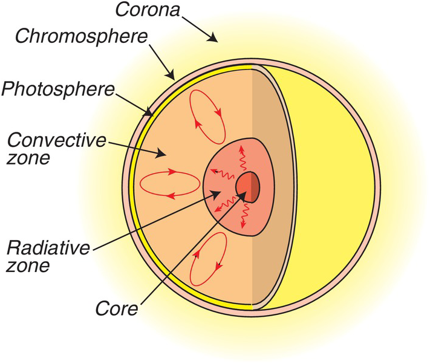
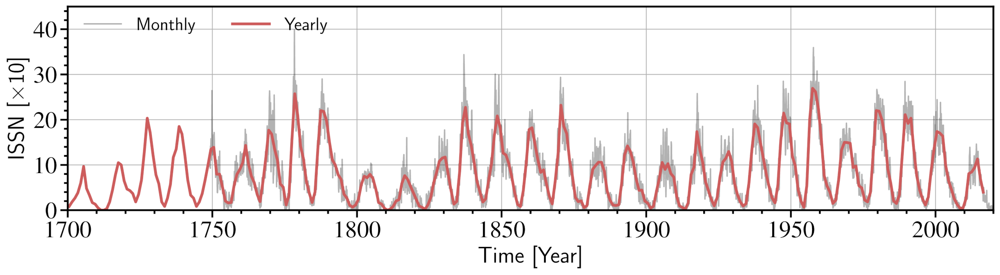
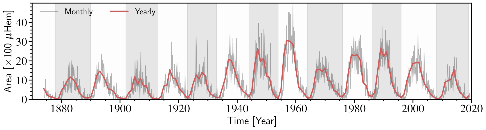
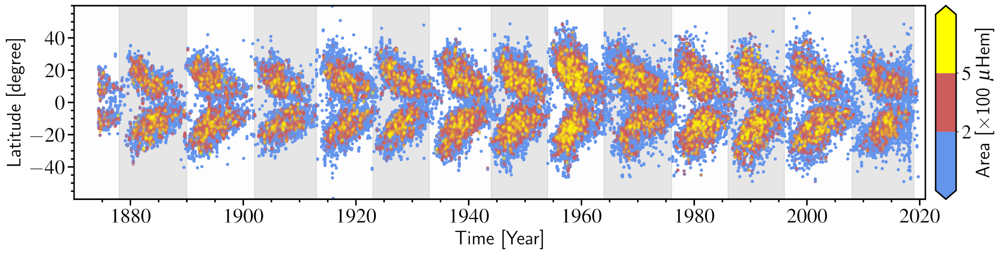
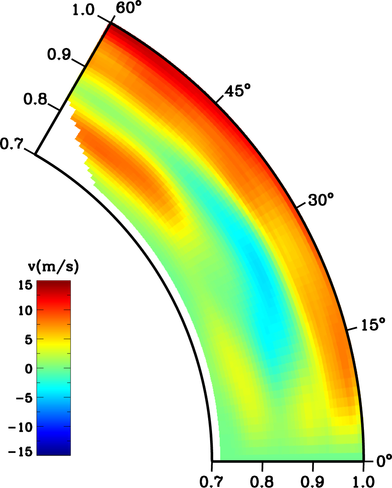
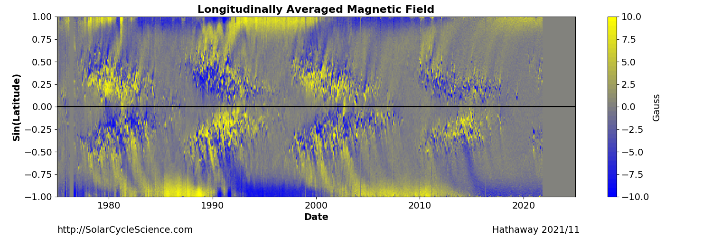
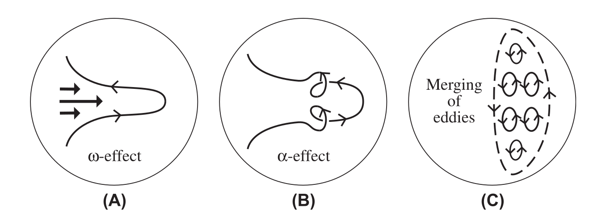
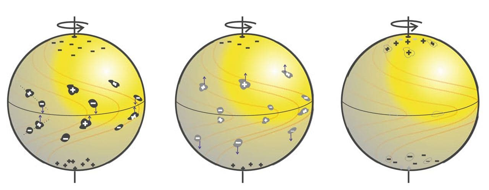

# Introduction {#Chap1}

::: epigraph
*"The purpose of life is the investigation of the Sun, the Moon, and the
heavens."*

--Anaxagoras
:::

The Sun, our backyard star, is far more fascinating than it may appear
in its first impression. Most of us believe it to be uninteresting
because it is just an ordinary star among the billions of stars that we
see in the night sky. However, the question is, if it is such a typical
star, what makes it so fascinating? The brief answer is that it is the
closest star to our home, i.e., the Earth, and it is the primary source
of energy for the survival of living beings on this blue planet. The
dependency of our life on this star for energy makes it necessary to
study and at the same time exciting to know the future of this ordinary
star. When we hear or see the word "Sun", the first thing that pops up
in our mind is a yellow star that rises in the East and sets in the West
every day. Even though the Sun looks the same in the sky every day, but
the importance of this yellow star did not remain hidden for long, and
the curious minds started realizing it very early. Starting from the
mythological story to the scientific quest, we have expanded our
horizons beyond the limit to understand the Sun. Being the closest star
to us provides an excellent opportunity to study it with enormous
details. Moreover, it also serve as a laboratory for stellar physics to
test their hypotheses and models. Throughout this thesis, we will try to
get an even more comprehensive answer to what makes the Sun even more
exciting.

The study of the Sun is broadly classified into two classes, the
short-term, where one studies the changes in Sun happening with the time
scale of seconds to days, and the long-term, where the changes happening
in the Sun over the years is studied. This thesis aims to understand the
long-term behaviour of the Sun and how it can help our understanding of
physics underneath. In this thesis, I will use the historical archival
data as obtained from the Kodaikanal Solar Observatory (KoSO) and
others, along with space-based data from Solar and Heliospheric
Observatory (SOHO) and Solar Dynamic Observatory (SDO). Before I explain
the details, let me start with our fundamental understanding of the Sun.

## The Sun

The Sun is young but around five billion-year-old, residing at around
150 Mkm from us. It has a mass of $\approx2\times10^{30}$ kg and is
primarily made up of Hydrogen ($\approx74.9\%$), Helium
($\approx23.8\%$) and some other metals [@Asplund2009]. It is a GII V
star burning hydrogen in its core via nuclear fusion, and the energy
produced in this process provides support against its gravity. The
structure of the Sun is broadly classified into two classes (i) internal
structure and (ii) solar atmosphere. I am going to discuss these two
classes briefly in the following subsections.

<figure id="fig1.1" data-latex-placement="!htbp">

<figcaption>The anatomy of the Sun labeling the different internal and
external structure of it .</figcaption>
</figure>

### Internal Structure

Being a black body makes the internal structure of the Sun invisible to
all the wavelengths, and it was almost impossible to peep inside the
Sun. The advent of a technique called helioseismology [@Dalsgaard2002]
gives us an opportunity to indirectly look inside the Sun to confirm its
internal structures known from the standard models [@Stix2012book],
which comprises of:

- **Core:** This is the powerhouse of the Sun, which spans around
  $\approx$`<!-- -->`{=html}20% its radius. This is the place where He,
  along with photons and neutrinos, are produced in *p-p* chain
  reaction. In this region of the Sun, temperature varies from
  $\approx$`<!-- -->`{=html}15 MK at its centre to
  $\approx$`<!-- -->`{=html}10 MK at its edge. The energy produced in
  this reaction not only provides support against gravity but also gives
  the energy that we receive on the Earth.

- **Radiative Zone:** The layer next to the core, which extends from
  0.2  to 0.7 , where radiation is the energy transport mechanism, is
  called the radiative zone. The gamma photons produced in the *p-p*
  reaction have to go through a random walk in this layer, and when it
  comes out of the Sun, it comes out as black body radiation peaking in
  the visible band. It takes around $1.7\times 10^5$ years for a photon
  to come out of the Sun and only around 8 minutes to reach us.

- **Tachocline:** In helioseismology observations, a very thin layer of
  around 4% of the solar radius, at 0.7 , has been discovered, which is
  called Tachocline [@Charbonneau1999]. In this region as we move from
  radiative zone to convection zone, the rotation profile of the Sun
  changes from almost solid body to differential. Now, it is believed
  that the rapid change in the rotation could possibly has important
  implication to solar dynamo for the generation of a large scale
  magnetic field in the Sun [@Miesch2005], see @Wright2016 for the more
  discussion about this layer.

- **Convection Zone:** This is the region of Sun above 0.7 and extends
  up to the visible surface. Here, the temperature is such that the
  electrons and nuclei start forming ions, leading to increased opacity
  and sufficient temperature gradient to start the convection. Here, the
  energy is transported via mass motion, which can be seen on the
  visible surface as granules.

### Solar Atmosphere

The modern space-based instruments, on-board SOHO, SDO etc., have taken
our capability to look at the Sun like never before. They enabled us to
image the different layers of the solar atmosphere by observing the Sun
in many wavelengths most of which are impossible to observe from the
ground-based instruments. These atmospheric layers are discussed below:

<figure id="fig1.2" data-latex-placement="!htbp">
<embed src="Figures/Chapter1/chapter_1_2.pdf" />
<figcaption>Image of the Sun as observed in different wavelength showing
different atmospheric layers (a) Photosphere in HMI Intensity Continuum;
(b) Chromosphere in AIA 304 Å; (c) Upper Transition region in AIA 171 Å;
(d) Corona in AIA 0.94 Å (<em>Image courtesy:
SDO/AIA</em>).</figcaption>
</figure>

- **Photosphere:** It is the visible surface of the Sun
  ([1.2](#fig1.2){reference-type="ref+label" reference="fig1.2"}a) and
  plays the role of the boundary between the solar interior and
  atmosphere. We notice a significant change in density in this region,
  making the solar plasma opaque to transparent. The temperature of this
  layer is around 5778 K; hence, plasma is weakly ionized here.

- **Chromosphere:** It is derived from the Greek word meaning " sphere
  of colour" because of its colourful appearance during the total solar
  eclipse. In this region, temperature initially falls for around 500 km
  and then starts increasing as the distance from the Sun increases.
  Even though this region of the solar atmosphere is primarily
  transparent in the visible band, it can be still observed in the
  H-alpha and He II lines. The [1.2](#fig1.2){reference-type="ref+label"
  reference="fig1.2"}b show the image of Sun observed He II line by
  SDO/AIA.

- **Transition Region:** This is an extremely thin region at the
  boundary of the chromosphere and corona. This region of the solar
  atmosphere has a large temperature gradient from thousands to million
  kelvin in a very short distance.
  [1.2](#fig1.2){reference-type="ref+label" reference="fig1.2"}c show
  the upper transition region as observed in AIA 171 Å.

- **Corona:** This is the outermost region of the Sun, which extend from
  the transition region to the interplanetary medium. This region of the
  Sun can only be naturally seen during the total solar eclipse because
  of its extremely low intensity compared to the photospheric intensity.
  The advancement of instruments has enabled us to observe it even
  without the total solar eclipse,
  [1.2](#fig1.2){reference-type="ref+label" reference="fig1.2"}d is one
  such example (AIA 94 Å). The extreme temperature, varying from a
  million kelvin to 10 MK, makes this region very interesting. The
  reason behind this unusual high temperature is still one of the
  outstanding problems of solar physics and known as the Coronal Heating
  problem. Apart from that, a frequent change in the magnetic topology
  makes this region very dynamic.

Now, since we got an idea about the atmospheric layer of the Sun, it's
time to talk about different features such as sunspots, active regions,
plages, filaments, prominences etc., which are seen in these layers. The
outstanding fact about these features is that they carry a lot of
information about the physical conditions where they originate, and
hence, the Sun. Therefore, by observing these features, one can enrich
the understanding of the Sun, and the development of modern instruments
has pushed our observing capability even further. One of the most
prolonged observed solar features is the sunspots which have a
significant place in this thesis and will be discussed in detail.

## Sunspot: Observers' Perspective {#ch1-sunspot}

On the visible surface of the Sun, the photosphere, sometime we see a
few dark spots ([1.3](#fig1.22){reference-type="ref+label"
reference="fig1.22"}) which are called sunspots. It has been reported
that the Chinese were the ones who first recorded these spots
[@Clark1978; @Wittmann1987], but the regular observation of these dark
spots only started at the beginning of the 17th century by Galilee
Galileo and Christoph Scheiner, just after Galileo's advent of the
telescope. Even though the systematic observation of sunspots started so
early, their physical nature was hidden to us till 1908. @Hale1908,
while working at Mount Wilson Observatory, by studying the Zeeman
splitting of a spectral line [@Zeeman1896], discovered that these
sunspots are the regions of the strong and concentrated magnetic field
(see [1.5](#fig1.6){reference-type="ref+label" reference="fig1.6"}) with
a typical field strength of $\sim 10^3$ G, which can go up to
2000--3700 G [@Solanki2003]. This is the first time the magnetic field
was observed outside the Earth. The presence of a strong magnetic field
suppress the convection which leads to the inefficient transfer of heat
to the photosphere [@Biermann1941]. The undersupply of heat result in
lower temperature ($\approx 4500$ K) in sunspots relative to their
surrounding ($5778$ K) and hence, they appear dark in the visible band.

<figure id="fig1.22" data-latex-placement="!htbp">
<embed src="Figures/Chapter1/sun_full_disk.pdf" style="width:50.0%" />
<figcaption>Full disk image of the Sun showing a few sunspots as
observed from HMI on 2014-04-07 (<em>Image courtesy:
SDO/HMI</em>).</figcaption>
</figure>

Sunspots as seen in the visible band (white light images) show a wide
range in their morphology, size (area on disk), lifetime etc., going to
be discussed briefly.

### Morphology of Sunspots

Sunspots are formed isolated ([1.4](#fig1.17){reference-type="ref+label"
reference="fig1.17"}a) as well as in the groups (sunspot group;
[1.4](#fig1.17){reference-type="ref+label" reference="fig1.17"}b),
consists of many sunspots. Most of the time, a typical sunspot has a
two-part structure, a central darker region called umbra surrounded by a
region lighter than umbra but darker than photosphere is called penumbra
(shown in [1.4](#fig1.17){reference-type="ref+label"
reference="fig1.17"}). The spot that lacks penumbra is referred as the
pores and believe to be the initial stage of sunspot formation [see
@Sobotka1999 and references therein]. Sunspots show a wide range of
shape and size; hence, based on their morphology, they are classified
into different categories such as A (uni-polar with no penumbra), B
(bipolar without penumbra) etc., [@McIntosh1990; @McIntosh2000 and
references therein]. After the 70s, the magnetic field measurement of
the Sun led to another classification scheme known as Mount Wilson
Magnetic classification scheme [@Smith1968] based on their magnetic
complexity, e.g. $\alpha$, $\beta$, $\delta$ etc.

<figure id="fig1.17" data-latex-placement="!htbp">
<embed src="Figures/Chapter1/chapter_1_17.pdf" style="width:70.0%" />
<figcaption>(a) An isolated sunspot (AR 397) and (b) a group of sunspots
(AR 431), observed using Swedish Solar Telescope on July 3, 2003 and Aug
14, 2003 respectively (<em>Image courtesy:
SST</em>).</figcaption>
</figure>

### Size of Sunspots

Sunspots show a broad spectrum in their sizes, starting from a few
thousand km to 60,000 km and even more [@Solanki2003]. Sometimes, they
could be so big that they can be seen with naked eyes provided the
favourable weather condition. The distribution of sunspot area shows a
log normal distribution which implies that the smaller sunspots are more
common than, the larger ones. This observation was first reported by
@Bogdan1988 based on the sunspot observation at Mt. Wilson Observatory.

The two-part structure of sunspots also encouraged to measure the ratio
of penumbra to umbra area, and plenty of effort has been done to look at
this ratio [@Antalova1971; @Hathaway2013; @Jha2018; @Jha2019]. These
studies show that the ratio increases initially with the size of the
sunspot, i.e., the whole sunspot area. A detailed discussion on this
ratio will be presented in
[\[Chap3\]](#Chap3){reference-type="ref+label" reference="Chap3"}.

### Lifetime of Sunspots

Similar to the sizes, sunspots also show a large variation in their
lifetime, it can vary from a few hours to months. Statistically, the
lifetime of a sunspot show linear dependence on its maximum size
[@Gnevyshev1938; @Waldmeier1955]. The relation is given by
$$\begin{equation}
    a_{\rm max} = W\tau,
    \label{eq1.25}
\end{equation}$$ where $a_0$ and $\tau$ are the maximum areas and
lifetime of the sunspot and, $W$ is proportionality constant having
value $10~\mu$Hem/day ($\mu$Hem is millionth of the solar hemisphere).
The value of $W$ has been further updated to $W=10.89\pm0.18~\mu$Hem/day
[@Petrovay1997].

### Bipolar Magnetic Region

Hale's discovery of magnetic field in the sunspots [@Hale1908] also
reveals that a group of sunspots are actually the regions of opposite
magnetic polarities residing very close to each other (see
[1.5](#fig1.6){reference-type="ref+label" reference="fig1.6"}). Due to
this reason, they are called Bipolar Magnetic Region (BMR), which is a
more general feature of sunspots. The two polarities if these BMRs are
named as leading and following polarities based on their movement on the
visible disk. Since the Sun is rotating from East to West, it appears
that one polarity of BMR is following the other. Hence, the polarity
(spot) towards the West is leading, and the one towards the East is
following polarity.

<figure id="fig1.6" data-latex-placement="!htbp">
<embed src="Figures/Chapter1/chapter_1_6.pdf" style="width:70.0%" />
<figcaption>(a) Intensity continuum (white light) image and (b) Line of
Sight Magnetogram as observed from SDO/HMI on 2013-02-05. The boxes
represent two same BMR regions in both images (<em>Image courtesy:
SDO/HMI</em>).</figcaption>
</figure>

The careful observation of these BMRs reveals that all BMRs in one
hemisphere have the same orientation (with few exceptions), and this
orientation is opposite in another hemisphere [@Hale1919]. This
interesting characteristic of BMRs is called "Hale's Polarity Law" after
@Hale1919. Furthermore, he also discovered that the leading and the
following spots reverse their sign in each cycle as shown in
[1.6](#fig1.8){reference-type="ref+label" reference="fig1.8"}. But
sometimes, we also notice that a few BMRs do not obey the Hale's
polarity law and are hence called "Anti Hale Sunspots". Even though such
BMRs are very few, they play a crucial role in our understanding of the
Sun and solar cycle models [@Karak2017; @Karak2018] to be discussed
later.

<figure id="fig1.8" data-latex-placement="!htbp">
<embed src="Figures/Chapter1/chapter_1_7.eps" style="width:70.0%" />
<figcaption>The magnetogram for Cycle-22 (left) and Cycle-23 (right),
with yellow and blue representing positive and negative polarity,
respectively. In Cycle-22, the leading and following polarity show the
opposite sign in the northern and southern hemispheres, and they flip
their signs in the next cycle, Cycle-23 .</figcaption>
</figure>

Now, the question arises, how are these BMRs or sunspots formed? To
understand that, let us consider a bundle of magnetic field lines which
constitute a flux-tube. Now, due to the presence of a magnetic field in
the flux tube, there will be an additional pressure inside called
magnetic pressure ($P_{\rm mag}$) along with gas pressure
($P_{\rm gas}$), which must be balanced by only gas pressure
($P_{\rm gas}$) outside. Hence, in equilibrium, $$\begin{align}
    P^{\rm out}=& P^{\rm in} \nonumber\\
    P_{\rm gas}^{\rm out}=&P_{\rm gas}^{\rm in}+P_{\rm mag}^{\rm in}, ~~~\because~~P_{\rm mag}^{\rm in}=\frac{B^2}{8\pi}\nonumber\\
    \therefore~~P_{\rm gas}^{\rm out} > &P_{\rm gas}^{\rm in};
\end{align}$$ which is not always but usually leads to,
$$\begin{equation}
    \rho^{\rm in}<\rho^{\rm out}.
\end{equation}$$ Lower density inside the flux tube will make it buoyant
[@Parker1955a], and hence it will come out of the photosphere and appear
as a BMR (shown in [1.7](#fig1.18){reference-type="ref+label"
reference="fig1.18"}).

{#fig1.18 width="70%"}

### Tilt of Bipolar Magnetic Region

A careful examination of the BMRs (or sunspot group) show that the line
joining the centre of leading and following polarity, is tilted with
respect the solar East--West direction, as shown in cartoon diagram
([1.8](#fig1.9){reference-type="ref+label" reference="fig1.9"}a) and in
magnetogram data ([1.8](#fig1.9){reference-type="ref+label"
reference="fig1.9"}b). This is called tilt ($\gamma$) of BMR, and it
systematically increases with the latitude of the BMR in both
hemispheres [@Hale1919]. The relation between tilt ($\gamma$) and
co-latitude ($\theta$) is called Joy's law and given as:
$$\begin{equation}
     \gamma = \gamma_0\cos{\theta}
     \label{eq1.2}
\end{equation}$$ where, $\gamma_0$ is a constant and called amplitude of
Joy's law.

<figure id="fig1.9" data-latex-placement="!htbp">
<embed src="Figures/Chapter1/chapter_1_9.pdf" style="width:80.0%" />
<figcaption>(a) Cartoon diagram, (b) magnetogram image  , showing the position of
leading and following polarity of BMR with respect to solar
equator.</figcaption>
</figure>

The tilt of BMR is induced by the effect of Coriolis force acting during
the rise of flux tube due to the rotation of the Sun. The Coriolis force
acting on the rising loop apexes has opposite direction and will try to
twist it, bringing one polarity closer to the equator and the other away
from it [@DSilva1993]. The systematic tilt observed in BMRs give rise to
net dipole moment, which have a significant impact on the flux transport
dynamo models (going to be discussed in the upcoming section),
particularly in Babcock-Leighton type dynamo models
[@Babcock1961; @Leighton1964; @Charbonneau2010].

The theoretical work of @DSilva1993 which explain the observed tilt in
the BMRs and its dependency on the latitude, hence unfold the physics
behind Joy's Law. In their work, @DSilva1993 have also elaborated the
role of the strength of the magnetic field, flux for the observed tilt
of BMRs.

## Solar Activity Cycle

The discovery of sunspot has significant influence on the observers
around the globe and prompt the systematic observation of these dark
spots. Even though Christian Horrebow gave the first indication of
variation in the appearance of these spots but it was not really
discovered until 1844 when Heinrich Schwabe [@Schwabe1844] reported the
existence of $\approx 10$ years periodicity in the number of appearance
of these spots. This turns out to be the discovery of solar activity
cycle or solar cycle. The discovery of the solar cycle has changed our
perspective about the Sun, and astronomers started turning their
telescopes towards it. Sunspots show a large variation in their shape
and size, and hence an obvious question raised is that how quantify it.
Here I discuss a few of them that are widely used as measures for solar
activity.

### Sunspot Number

Encouraged by the discovery of the solar cycle by Schwabe, Rudolf Wolf,
working at Bern Observatory, initiated the regular observation of these
spots. He also devised the way to calculate the number of sunspots on
the solar disk, called "relative sunspot number (R)" or "International
Sunspot Number (ISN)" or "Zurich Number", defined as $$\begin{equation}
    R=k(10g+n)
    \label{eq1.1}
\end{equation}$$ where $k$ is the correction factor, $g$ is the number
of groups and, n is the number of isolated sunspots. If we look
carefully at the [\[eq1.1\]](#eq1.1){reference-type="ref+label"
reference="eq1.1"}, we notice that it gives higher priority to the
groups which is because they are easy to identify on the solar disk.
Later in 1981, the Belgium Observatory also started the regular
observation of sunspots which continued till date, and these data are
freely available to the community via the Solar Influences Data Analysis
Center (SIDC)[^1]. Today, the international sunspot number has been
treated as one of the best proxies for solar activity; it is not because
everyone agrees to it, but because of its availability.
[1.9](#fig1.3){reference-type="ref+label" reference="fig1.3"} shows the
variation of monthly and yearly sunspot numbers taken from WDC-SILSO.
ISN is the one, which is mainly used in the community as the best proxy
for solar activity, there are few others, such as sunspot area, 10.7 cm
Solar Flux [@Tapping1994], etc., that have been also regularly used for
the same.

<figure id="fig1.3" data-latex-placement="!htbp">

<figcaption>Variation of monthly and yearly sunspot number with time
(<em>Source: WDC-SILSO, Royal Observatory of Belgium,
Brussels</em>).</figcaption>
</figure>

### Sunspot Area

It is advocated that the area covered by the sunspots have greater
physical significance than the sunspot number. Therefore, in 1874, Royal
Observatory, Greenwich (RGO) started compiling the sunspot area and its
position on the disk from the photographic plates. These plates were
collected from different observatories around the globe, including
Kodaikanal Solar Observatory, India. RGO continued reporting the sunspot
area till 1976, and then Debrecen Observatory [@Gyori2010; @Baranyi2016]
joined the campaign and started updating the area series. Realising the
importance of this series, recently @Mandal2020 has cross-calibrated the
sunspot area data taken from different observatory. The cross-calibrated
monthly, and yearly, sunspot area data from RGO and NOAA is shown in
[1.10](#fig1.4){reference-type="ref+label" reference="fig1.4"}.

<figure id="fig1.4" data-latex-placement="!htbp">

<figcaption>Monthly and yearly averaged, cross-calibrated sunspot area
series as reported in .</figcaption>
</figure>

In India, Kodaikanla Solar Observatory (KoSO) has also started the
regular observation of the Sun from the beginning of 20th century and
the area time series from the digitized data have been reported in
@Ravindra2013 and [@Mandal2017a].

### Other Proxies

Apart from ISN and Sunspot Area there are multiple physical quantities
such as 10.7 cm Solar Flux, Total Solar Irradiance, Geomagnetic
Activity, Cosmic Ray Modulation and etc. that show a good correlation
with the ISN [see @Hathaway2015 and references therein for details].
Here I discuss a few of them.

- **10.7 cm Solar Flux:** Another measure of solar activity period is
  the disc integrated radio flux observed at 10.7 cm [2800 MHz;
  @Tapping1994]. Starting from 1946 Canadian Solar Radio Monitoring
  Program and then in 1990 new observation program at Penticton British
  Columbia regularly measures radio flux from the Sun. The radio flux
  measurements show a good correlation with the ISN [@Holland1984].

- **Total Irradiance:** The total energy from the Sun integrated over
  all wavelengths per unit area per second outside the Earth's
  atmosphere is called Total Solar Irradiance (TSI). The accurate
  measurement of TSI was not possible before the development of
  space-borne instruments such as Nimbus-7 (1978--1993), Solar Maximum
  Mission (SMM), ACRIM-I (1980--1989), Earth Radiation Budget Satelite
  (ERBS; 1984--1995) etc. This observation of the TSI suggests that it
  also varies with solar activity and shows a good correlation with ISN
  and, hence, a possible candidate for activity measurement
  [@Hathaway2015 and references therein].

- **Cosmic Ray Modulation:** A cosmic ray contains high energy (GeV)
  particles produced in violent cosmic phenomena. When a positively
  charged one reaches the Earth atmosphere, it makes a cascading shower
  of particles. These could be measured by monitoring neutrons, and the
  number of neutron particles shows anti-correlation with ISN.
  @Parker1965 explained that during high activity, these particles get
  scattered by the magnetic structure carried by the solar wind
  responsible for reduction in neutron number.

### Characteristics of Solar Cycle

The consistent observation of the sunspots over many cycles uncovered so
many solar cycle characteristics. Many of them are common, but still, a
few show differences, making the sun even more interesting. A few
aspects which will be frequently used in this thesis are discussed
below.

1.  **Spoerer's Law of Zones:** The latitude time diagram of these spots
    show a beautiful pattern like butterfly (as seen in
    [1.10](#fig1.4){reference-type="ref+label" reference="fig1.4"}) and
    called "Butterfly Diagram" or "Spoerer's Law of Zones'' first
    reported by [@Maunder1903; @Maunder1904]. At the beginning of the
    solar cycle we observe the sunspots at higher latitude around
    $30^\circ -35^\circ$ in both the hemisphere but as the cycle
    progress sunspots start appearing towards the equator
    ([1.11](#fig1.5){reference-type="ref+label" reference="fig1.5"}).

    <figure id="fig1.5" data-latex-placement="!htbp">
    
    <figcaption>A composite Latitude-Time diagram of sunspot position on the
    solar disk is known as the “Butterfly Diagram”. This plot is generated
    using cross-calibrated data reported in .</figcaption>
    </figure>

2.  **Cycle Maxima and Minima:**The solar maxima and minima times play a
    crucial role in understanding the solar activity cycle. Getting an
    exact time of maxima and minima is a little tricky due to inherent
    noise in the data. It is necessary to smooth the ISN in some way to
    get the proper time of occurrence of maxima and minima. Currently,
    these times are calculated from the 13-month running average,
    centred at the month of interest, over monthly mean sunspot number
    data [@Clette2016; @Hathaway2015]. This is similar to the method
    used earlier by @Waldmeier1961 [@McKinnon1987].

3.  **Cycle Period:** Like any other periodic function, the solar cycle
    period is also defined as the time between two consecutive minima
    accompanying a maximum (sometimes more than one). In the case of the
    solar cycle, this definition has one issue, as each solar cycle
    starts a little earlier than the preceding minima and stays a little
    longer than the following maxima. Apart from that, the accuracy in
    the time calculation of minima also impacts the measurement of the
    activity period. Hence, the cycle period depends on the cycle of
    interest and the method used to determine it. Usually, the average
    cycle period is calculated as the time difference between two minima
    divided by the cycles it includes. Based on that, the average cycle
    period is around 131.7 months which is $\approx$ 11 years
    [@Hathaway2015 and references therein].

4.  **Cycle Amplitude or Strength:** The solar cycle amplitude or
    strength is the maximum number of smoothed ISN or any other proxy.
    It has been noticed that the cycle's amplitude depends on the proxy
    and method of smoothing used before determining it. Therefore, the
    amplitude of the solar cycle differ from each other when different
    proxies are used, e.g., Cycle-15 and 16 have similar amplitude when
    sunspot area is used as a proxy but differ significantly in the case
    of ISN [@Hathaway2015 and references therein]. This becomes even
    more complicated in the case of double peak cycles [e.g., Cycle-20 &
    22; @Karak2018b].

5.  **The Waldmeier Effect:** Most of the time, the rise time of a solar
    cycle is shorter than the time it takes to reach maximum to minimum
    @Waldmeier1935. In addition, it has also been observed that the rise
    time of a cycle is anti-correlated with the amplitude of the cycle,
    and this effect is called "Waldmeir Effect" after @Waldmeier1935
    [@Waldmeier1939]. The theoretical explanation for the observed
    effect was given by @Karak2011.

## Long--term Variability

Apart from the dominant 11 years solar activity cycle, the historical
observation of the Sun also show long-term variation in solar activity
[@Maunder1890; @Eddy1976; @Hoyt1998; @Solanki2004; @Usoskin2013]. In
[1.9](#fig1.3){reference-type="ref+label" reference="fig1.3"} and
[1.10](#fig1.4){reference-type="ref+label" reference="fig1.4"}, we see
that all the cycles are not the same; they differ from each other in
amplitude as well as period. This significant variation that we see in
solar activity might play an essential role in understanding and
predicting future cycles [@Petrovay2020]. There are a few major aspects
of long-term variation of the solar cycle, which are discussed below.

<figure id="fig1.5_1" data-latex-placement="!htbp">
<embed src="Figures/Chapter1/chapter_1_5_1.eps" style="width:80.0%" />
<figcaption>The yearly averaged sunspot number for the last 400 years as
a function of time .</figcaption>
</figure>

### The Maunder Minimum

In [1.12](#fig1.5_1){reference-type="ref+label" reference="fig1.5_1"},
during the period 1645 to 1715, we notice very little activity and this
is called "The Maunder Minimum". This curious behaviour of the Sun was
first reported by [@Maunder1890] while compiling the work of Spoerer's
and later by @Eddy1976 with more observational support. @Hoyt1998
reported the complete observation during this period depicting the
drought of activity in that period. [@NesmeRibes1993] results also
indicated the presence of a weak magnetic field in this period. The
other proxies for solar activity, such as $^{10}$Be [@Beer1998] and
$^{14}$C [@Stuiver1980] revels that the solar activity was so weak
during that period it produced very small or no sunspots in the period.
These observation also indicate the existence of many such extreme
events in the history of Sun [@Usoskin2013], and it is still an open
problem of solar physics.

### The Secular Trend

Just after the Maunder Minimum, we notice the slight but steady increase
in the solar cycle amplitude, which was earlier reported by @Wilson1988
and recently by @Svalgaard2012. @Hathaway2002 also noted the positive
correlation coefficient (0.7) between the amplitude and number of
cycles. Furthermore, A recent result based on radioisotope shows many
such upward and a downward trends in the solar activity period in the
$11,000$ years [@Solanki2004]. Although the trend is minimal, it might
still significantly impact the understanding of the Sun.

### Even--Odd Effect

There is an interesting characteristic of inter cycle variation of cycle
amplitude called "Even--Odd rule" or "Gnevyshev--Ohl Rule" after its
discovery by @Gnevyshev1948. They found that the sum of the number of
sunspots in even numbered cycle is lower than the odd numbered cycle,
with few exceptions [see @Hathaway2015 Figure 40]. Our current
understanding of the Sun cannot answer why such a pair exists at all?
However, the observational support to this inter cycle property impacts
our solar activity models [@Sheeley2005].

### Other Long--term Trends

There are few others observed periodic variation in cycle amplitude such
as a period of $\approx9.1$-cycles called "The Gleissberg Cycle"
[@Gleissberg1939; @Hathaway2015; @Usoskin2013], and
$\approx$`<!-- -->`{=html}210 years, reported based on the radiocarbon
studies often refered as the Suess or de Veies cycle [@Suess1980].

## Large--scale Flows in the Sun {#ch1-largemotion}

The observations of sunspots have not only helped us to understand the
magnetic nature of the Sun but it has taken us even beyond that. One can
infer that the Sun is rotating by looking at the position of sunspots on
the visible disk. The methodical measurement of sunspots position on the
visible disk has enabled us to measure the solar differential rotation.
Based on these measurements, we know that there are two major
large-scale flows in the Sun (i) differential rotation and (ii)
meridional circulation, which I will discuss in the following sections.

### Differential Rotation {#s-differential}

In the past, historical observations of sunspots and other solar
features have been utilized (as a tracer) so many times to measure the
photospheric solar differential rotation [see a review by @Beck2000 and
references therein]. Based on these observation the solar differential
rotation can be expressed as a function of co-latitude ($\theta$)
$$\begin{equation}
    \Omega(\theta) = A+B\cos^2{\theta}+B\cos^4{\theta},
    \label{eq1.3}
\end{equation}$$ where $A$ is equatorial rotation rate and $B$, and $C$
are called latitudinal gradients [@Beck2000 and reference therein]. The
issue with this method is that we see very few or no features during the
minimum activity period, hence making the measurement difficult.
Therefore, another method, such as spectroscopy, is also used to measure
the solar differential rotation [@Howard1970]. A major breakthrough came
in understanding solar differential rotation after the helioseismology
era. Helioseismology uses the different modes of oscillation in the Sun
to map the solar differential rotation profile to the surface as shown
in [1.13](#fig1.12){reference-type="ref+label" reference="fig1.12"}a
(from the 0.5 to ). Variation of latitudinally averaged rotation profile
with solar radius is shown in
[1.13](#fig1.12){reference-type="ref+label" reference="fig1.12"}b. In
both the figure a sharp change in rotation profile is noticed at 0.7.
The detail discussion about the solar differential rotation will be
presented in [\[Chap4\]](#Chap4){reference-type="ref+label"
reference="Chap4"}.

<figure id="fig1.12" data-latex-placement="!htbp">
<embed src="Figures/Chapter1/chapter_1_11.pdf" />
<figcaption>(a) Differential rotation map (b) latitudinal average
rotation profile as a function of radius of the Sun as infered from
helioseismology observation </figcaption>
</figure>

### Meridional Circulation

Another aspect of large scale flow in the Sun is a flow confined in the
meridional plane, a plane that passes through the rotation axis and
perpendicular to the equatorial plane, called meridional circulation.
Meridional circulation is the motion of plasma from the equator towards
the pole (shown in [1.14](#fig1.13){reference-type="ref+label"
reference="fig1.13"}) ; since we do not expect plasma to pile up near
the pole, it must return to the equator at some depth below the solar
surface, in both the hemisphere [@Rajaguru2015; @Chen2017]. It takes a
little while to infer this motion in the Sun due to its very low
magnitude [20 ms$^{-1}$; @Choudhuri2021b]. The meridional circulation is
far weaker than the other motion on the surface, and that is the reason
it is so difficult to measure. There is something very interesting about
the meridional circulation; it transports various solar features with it
to the pole, making it possible to infer at least. If we look at the
magnetic butterfly diagram ([1.16](#fig1.10){reference-type="ref+label"
reference="fig1.10"}), we notice the poleward transport of magnetic
flux, which is responsible for polarity reversal, is believed to be
carried by meridional circulation [@Charbonneau2010; @Choudhuri2021b].

<figure id="fig1.13" data-latex-placement="!htbp">

<figcaption>The flow pattern in a quadrant of the meridional plane
representing meridional circulation .</figcaption>
</figure>

## Global Magnetic Field

So far, I have only talked about the magnetic field in the sunspots
i.e., the magnetic field only localized in some regions, now I will,
talk about the global magnetic field of the Sun.

In the second half of the 20th century, the works of @Babcock1958
[@Babcock1959] suggests that the polar field of the Sun reverses its
polarity systematically every 11 years, and this polarity reversal
happens during the time of maximum solar activity. After this discovery
around a decade later, Wilcox Solar Observatory [WSO; @Scherrer1977]
started to measure the polar field of the Sun regularly. This
observation confirms the findings of @Babcock1958 [@Babcock1959] and it
also highlights that these polarity reversals do not need to occur at
the same time in both the hemisphere-it might have delay of months to
years. Another interesting fact about the polar field is its strength,
which is of the order of a few Gauss contrary to the field measured in
sunspots is of kilo Gauss [@Hale1908]. The smoothed polar field is shown
in [1.15](#fig1.21){reference-type="ref+label" reference="fig1.21"} as
measured at WSO.

<figure id="fig1.21" data-latex-placement="!htbp">
<embed src="Figures/Chapter1/PolarFields.eps" />
<figcaption>Polar field measurement of the Sun at WSO. The solid and
dotted lines represent the polar field for the Northern and Southern
hemispheres. The solid red curve at the bottom represents the scaled
smoothed ISN. .</figcaption>
</figure>

In the early 1970s the Kitt Peak National Observatory (KPNO) started
measuring line of Sight (LOS) magnetic field map (magnetogram) of the
Sun. Later, National Solar Observatory [NSO- SOLIS; @Keller1998] with
slightly better resolution joied the hands and started observing the
full disk magnetogram. A substantial change happened after the
development of space based instruments like Michelson Doppler Imager
(MDI) on the Solar and Heliospheric Observatory [SOHO, 1996;
@Scherrer1995], and Helioseismic and Magnetic Imager (HMI) on-board
Solar Dynamic Observatory [SDO, 2010; @Schou2012]. In
[1.16](#fig1.10){reference-type="ref+label" reference="fig1.10"}, we
show the longitudinally averaged radial magnetic field of map of the
Sun, which is called magnetic butterfly diagram, for the last
four-cycle. We notice in the diagram that the butterfly wings are
dominated by opposite polarities in the northern and southern
hemispheres, near the equator and the pole, as expected based on Hale's
Polarity law. Moreover, we also observe that higher latitude field is
transported to the pole, where they are eventually responsible for the
polarity reversal during the maximum time [@Mordvinov2022].

<figure id="fig1.10" data-latex-placement="!htbp">

<figcaption>An azimuthally averaged magnetic map of the Sun stitched
together to form a magnetic butterfly diagram. The map is constructed
using the data taken from Kitt Peak, SOHO/MDI and SDO/MHI (<em>Image
courtesy: David H. Hathaway</em>).</figcaption>
</figure>

These observations of global solar activity not only reveal the cyclic
nature of solar magnetism it also helps us to understand the change in
magnetic field configuration during the solar cycle. During the minimum
activity period, the magnetic field configuration of the Sun is like a
bar magnet and called a poloidal field
([1.17](#fig1.10_1){reference-type="ref+label" reference="fig1.10_1"}a);
on the other hand, the field configuration is like a toroid in the plane
parallel to the equator and called a toroidal field
([1.17](#fig1.10_1){reference-type="ref+label" reference="fig1.10_1"}b).
The poloidal field of a few Gauss is getting converted to the toroidal
field and amplified to the order of kilo Gauss [as observed in the form
of sunspots; @Choudhuri2003], which is responsible for the generation of
sunspots (). After that, the diffused magnetic flux is transported to
the pole by meridional circulation, which is responsible for polarity
reversal ([1.16](#fig1.10){reference-type="ref+label"
reference="fig1.10"}) and generation of poloidal field with opposite
orientation ([1.17](#fig1.10_1){reference-type="ref+label"
reference="fig1.10_1"}b). The conversion of poloidal to toroidal and
back to poloidal with opposite polarity takes around 11 years (solar
cycle). In contrast, it takes around 22 years to get the same global
magnetic field configuration, known as the magnetic cycle.

<figure id="fig1.10_1" data-latex-placement="!htbp">
<embed src="Figures/Chapter1/dynamo_cycle.pdf" style="width:95.0%" />
<figcaption>A flow diagram showing the cyclic nature of solar magnetism
based on the observation.</figcaption>
</figure>

Now, it is essential to understand the physics behind all these observed
behaviour of the Sun and here comes the solar dynamo theory which is
discussed in .

## Solar Dynamo {#ch1-dynamo}

Hitherto, we have only discussed about the observation aspects of the
Sun, the solar activity cycle, solar magnetism, and large-scale flows.
This section will discuss the causes of the observed aspects of solar
magnetism based on our current understanding of the solar dynamo, which
is believe to operating in the convection zone of the Sun.

The "Solar Dynamo" is the mechanism that helps the Sun amplify and
sustain its magnetic field. Joseph Larmer was the first person who came
up with the idea about the inductive action of the fluid, and it turned
out to be the foundation stone for the solar dynamo. In his idea, the
axisymmetric solar differential rotation was an obvious choice
responsible for amplification and conversion of poloidal (configuration
of the magnetic field during solar minimum) field to toroidal field
(configuration of the magnetic field during solar maximum). Moreover, it
also nicely fit Hale's polarity law [@Hale1919]. A major hurdle came
into the path of this idea as Cowling's anti-dynamo theorem
[@Cowling1933]. This theorem says that axisymmetric flows could not, in
themselves, maintain the self-sustaining axisymmetric magnetic field,
against the Ohmic dissipation [@Cowling1933; @Charbonneau2010].
@Parker1955 came with the idea that can bypass this problem. He pointed
out that the Coriolis force will twist the rising fluid elements in the
solar convection zone due to the rotation of the Sun and so break the
axisymmetry. This groundbreaking idea led to the development of
mean-field electrodynamics, the theory of solar dynamo modelling. Before
I discuss the mean-field dynamo models, let's briefly discuss the
fundamental equations of magnetohydrodynamics (MHD), which is at the
crust of solar dynamo models.

### MHD Equations to Solar Dynamo

In a magnetised medium, there are four set of equations (eight scalar)
that describe the complete dynamical system [@Choudhuri1998book]. These
equations are as follow and all the terms have their standard meaning
[see @Priest2014book for details about these equation].

1.  The most important equation of MHD, which talk about the inductive
    effect of the flow and called induction equation is given as,
    $$\begin{equation}
        %Induction Equation
         \frac{\pa\vb{B}}{\pa t}=\bm{\nabla}\times[\vb{v}\times\vb{B}-\lambda\bm{\nabla}\times\vb{B}]. \label{eq1.6}
    \end{equation}$$

2.  The second in the list is called momentum equation and it talk about
    the conservation of momentum and written as, $$\begin{equation}
        % Momentum Equation
        \rho\frac{d\vb{v}}{dt}=-\bm{\nabla}p+\frac{1}{4\pi}(\bm{\nabla}\times\vb{B})\times \vb{B}+\vb{F}+\nu\bm{\nabla}^2\vb{v}.   \label{eq1.5}
    \end{equation}$$

3.  The third equation in the set is the continuity equation which
    describe the conservation of mass and given as, $$\begin{equation}
        % Continuity Equation
        \frac{d\rho}{dt}+ \rho\bm{\nabla}\cdot\vb{v}=0.
        \label{eq1.4}
    \end{equation}$$

4.  The fourth and final equation in this set is the energy conservation
    equation, which is $$\begin{equation}
         %Energy Equation
         \frac{\rho^\gamma}{\gamma-1}\frac{d}{dt}\left( \frac{p}{p^\gamma}\right)=-\bm{\nabla}\cdot\vb{q}-L_r+\frac{j^2}{\sigma}+F_H.
        \label{eq1.7}
    \end{equation}$$

If we consider in-compressible fluid for simplicity, the continuity
equation ([\[eq1.4\]](#eq1.4){reference-type="ref+label"
reference="eq1.4"}) and energy equation
([\[eq1.7\]](#eq1.7){reference-type="ref+label" reference="eq1.7"})
become redundant and we only left with momentum and induction equations
([\[eq1.5\]](#eq1.5){reference-type="ref+label" reference="eq1.5"} and
[\[eq1.6\]](#eq1.6){reference-type="ref" reference="eq1.6"}). Let's have
a detailed look at the induction equation first
([\[eq1.6\]](#eq1.6){reference-type="ref+label" reference="eq1.6"}).
$$\begin{equation}
    \frac{\pa\vb{B}}{\pa t}=\underbrace{\bm{\nabla}\times(\vb{v}\times\vb{B})}_{\text{Inductive }}-\underbrace{\bm{\nabla}\times(\lambda\bm{\nabla}\times\vb{B})}_{\text{Dissipative}}, \label{eq1.8}
\end{equation}$$ the first term in this equation is a source term, and
another is Ohmic dissipation. The relative significance of these two
terms is measured in terms of magnetic Reynolds Number (${\rm R_m}$),
which is the ratio of two terms, $$\begin{equation}
{\rm R_m}=   \frac{vL}{\lambda}=\frac{L^2}{\lambda \tau}.
\label{eq1.9}
\end{equation}$$ In the case of the Sun, this number is pretty huge and
one can ignore the second term, which makes it little simpler. A further
simplistic approach is used by assuming a given velocity field which
again makes it unnecessary to solve the momentum equation
([\[eq1.5\]](#eq1.5){reference-type="ref+label" reference="eq1.5"}), and
this approach is known as the "kinematic approach" or "kinematic dynamo
problem" [@Karak2014]. Therefore, in this approach, only the induction
equation is sufficient to understand the magnetic field's evolution for
a given velocity field. In the first impression, this assumption may be
ad-hock, but the recent observation of solar differential rotation and
meridional circulation [@Dalsgaard2002] have shown that this assumption
is not so inappropriate.

Now, once we have the velocity field ($\vb{v}$) in such a way that it
can sustain the magnetic field in the Sun against Ohmic Dissipation, the
source term in induction equation will amplify the magnetic field by
shearing, compression and transport as seen in the equation
$$\begin{equation}
    \bm{\nabla}\times(\vb{v}\times\vb{B})=\underbrace{(\vb{B}\cdot\bm{\nabla})\vb{v}}_{\text{Shearing}}-\underbrace{\vb{B}(\bm{\nabla}\cdot\vb{v})}_{\text{compression}}-\underbrace{(\vb{v}\cdot\bm{\nabla})\vb{B}}_{\text{Transport}}.
    \label{eq1.10}
\end{equation}$$ One point is worth noticing that the first term
(shearing) itself of this equation will give rise to the required
amplification of the magnetic fields.

#### The Solar Dynamo Problem {#the-solar-dynamo-problem .unnumbered}

Although the [\[eq1.11\]](#eq1.11){reference-type="ref+label"
reference="eq1.11"} is sufficient enough to sustain and amplify the
magnetic field, the dynamo problem in case of the Sun is more profound,
and it is much more than sustaining and amplifying the field. We need a
cyclic generation of the magnetic field along with other observed solar
cycle characteristics. The axisymmetric solar differential rotation can
amplify the poloidal field but the conversion of poloidal back to
toroidal is ruled out by anti-dynamo theorem in case of axisymmetric
flows. This leads to the development of mean field dynamo model which
was qualitatively given by @Parker1955 and the mathematical formulation
for the same was demonstrated by @Krause1980, keeping the following
shopping list in mind [@Charbonneau2010].

- A polarity reversal with a periodicity of 11 years.

- Equatorial migration of sunspot generating magnetic field i.e.,
  butterfly diagram.

- Migration of diffused magnetic flux towards the pole.

- Anti-symmetric with respect to equator, i.e., Hales's polarity law,

- Poloidal and toroidal field strength in agreement with the
  observation.

- Last but not the least, the model should also be able to produce a
  fluctuation in the cycle amplitude.

Now I will briefly discuss the different dynamo models while keeping our
shopping list in mind.

### Mean Field Dynamo Model

A simple and axisymmetric solution for a solar dynamo models has been
already ruled out by Cowling's anti dynamo theorem [@Cowling1933]. Eugen
Parker's qualitative idea about the effect of Coriolis force
[@Parker1955] came as a savior and further leads to the mean field
electrodynamics or mean field dynamo model.

In mean field dynamo model, since we are only interested in the
evolution of the system only in the large scale hence a physical
quantity can be written as the sum of its large scale mean and small
scale fluctuation. Therefore, in this context velocity and magnetic
field could be written as $$\begin{equation}
    \vb{v}=\vb{\langle v\rangle}+\vb{v^\prime}~~\&~~\vb{B}=\vb{\langle B\rangle}+\vb{B^\prime}.
    \label{eq1.11}
\end{equation}$$ Where, $\angles{\vb{v}^\prime}=0$ and
$\angles{\vb{B}^\prime}=0$. If we use these assumption in induction
equation ([\[eq1.6\]](#eq1.6){reference-type="ref+label"
reference="eq1.6"}) $$\begin{equation}
    \frac{\pa}{\pa t}(\angles{\vb{B}}+\vb{B^\prime})=\bm{\nabla}\times\left[ (\angles{\vb{v}}+ \vb{v^\prime})\times (\angles{\vb{B}}+ \vb{B^\prime)} -\lambda\bm{\nabla}\times(\angles{\vb{B}}+\vb{B^\prime})\right].
    \label{eq1.12}
\end{equation}$$ After simplification and taking the average we will get
$$\begin{equation}
    \frac{\pa}{\pa t}\angles{\vb{B}}=\bm{\nabla}\times\left[\angles{\vb{v}}\times \angles{\vb{B}}+\angles{\vb{v}^\prime\times\vb{B}^\prime} -\lambda\bm{\nabla}\times\angles{\vb{B}}\right].
    \label{eq1.13}
\end{equation}$$ Now since I am going do deal with only average quantity
so I can drop the average sign and replace $\angles{\vb{B}}$ by
$\vb{B}$, and hence $$\begin{equation}
    \frac{\pa \vb{B}}{\pa t}=\bm{\nabla}\times\left(\vb{v}\times \vb{B}+ \bm{\mathcal{E}} -\lambda\bm{\nabla}\times\vb{B}\right).
    \label{eq1.14}
\end{equation}$$ where
$\mathcal{E}=\angles{\vb{v}^\prime\times\vb{B}^\prime}$ and called "mean
turbulant electromotive force". In case of homogeneous and isotropic
turbulence $\mathcal{E}$ could be written as
[@Choudhuri1998book; @Charbonneau2010] $$\begin{equation}
    \bm{\mathcal{E}}=\alpha \vb{B}-\beta\bm{\nabla}\times \vb{B},
    \label{eq1.15}
\end{equation}$$ where $\alpha$ and $\beta$ are tensors, which depend on
the statistical properties of the flow [@Krause1980]. Using
[\[eq1.15\]](#eq1.15){reference-type="ref+label" reference="eq1.15"} in
[\[eq1.14\]](#eq1.14){reference-type="ref+label" reference="eq1.14"} we
get $$\begin{equation}
    \frac{\pa \vb{B}}{\pa t}=\bm{\nabla}\times\left[\vb{v}\times \vb{B}+ \alpha \vb{B} -(\lambda+\beta)\bm{\nabla}\times\vb{B}\right],
    \label{eq1.16}
\end{equation}$$ where, $\lambda+\beta$ is called magnetic diffusivity
[@Charbonneau2010] and this is the called the basic dynamo equation
[@Choudhuri1998book].

Now, let's consider the magnetic and velocity field of the form of
axisymmetric poloidal and azimuthal (toroidal) components
$$\begin{align}
    \vb{B}(r,\theta,t)&=\underbrace{\bm{\nabla}\times (A(r, \theta, t)\bm{\hat{e}}_\phi)}_{\text{Poloidal}}~+~\underbrace{B(r,\theta,t)\bm{\hat{e}}_\phi}_{\text{Toroidal}}, ~~\text{and} \label{eq1.17}\\
     \vb{v}(r,\theta)&=\underbrace{v_r(r,\theta)\bm{\hat{e}}_r+v_\theta(r,\theta)\bm{\hat{e}}_\theta}_{\text{Meridional  Circulation}~(\vb{v}_{\rm p})}~~+~~\underbrace{\bar{\omega}\Omega(r,\theta)\bm{\hat{e}}_\phi}_{\text{Diff. Rotation}}, \label{eq1.18}
\end{align}$$ where $\bar{\omega}=r\sin{\theta}$ and $\Omega$ is the
angular velocity. Substituting
[\[eq1.17\]](#eq1.17){reference-type="ref+label" reference="eq1.17"} and
[\[eq1.18\]](#eq1.18){reference-type="ref" reference="eq1.18"} in
[\[eq1.16\]](#eq1.16){reference-type="ref+label" reference="eq1.16"} and
using $\bm{\nabla}\cdot\vb{v}_{\rm p}$ (incompressiblilty). We can
separate [\[eq1.16\]](#eq1.16){reference-type="ref+label"
reference="eq1.16"} into two equations of $B$ and $A$ [for derivation
see @Choudhuri1998book; @Charbonneau2010; @Priest2014book].
$$\begin{align}
    \frac{\pa B}{\pa t}=&(\lambda+\beta)\left( \bm{\nabla}^2-\frac{1}{\bar{\omega}^2}\right)B+\frac{1}{\omega}\frac{\pa(\bar{\omega}B)}{\pa r}\frac{\pa(\lambda+\beta)}{\pa r}-\bar{\omega}\vb{v}_{\rm p}\cdot\left( \frac{B}{\bar{\omega}}\right)\nonumber\\
    &+\underbrace{\bar{\omega}[\bm{\nabla}\times(A\bm{\hat{e}}_\phi)]\cdot\bm{\nabla}\Omega}_{\text{shear}}~+~\underbrace{\bm{\nabla}\times[\alpha\bm{\nabla}\times(A\bm{\hat{e}}_\phi)]}_{\text{MFT source}}\label{eq1.19}\\
%%
    \frac{\pa A}{\pa t}=&(\lambda+\beta)\left( \bm{\nabla}^2-\frac{1}{\bar{\omega}^2}\right)A-\frac{\vb{v}_{\rm p}}{\bar{\omega}}\cdot\bm{\nabla}(\bar{\omega}A)+\underbrace{\alpha B}_{\text{MFT source}} \label{eq1.20}
\end{align}$$

If we carefully look at these equations, we see the additional source
term coming due to the mean-field theory (MFT), and these two terms play
a significant role in circumventing Cowling's anti dynamo theorem
[@Cowling1933]. In the case of the Sun, the shear term dominates over
the MFT term [@Charbonneau2010] in
[\[eq1.19\]](#eq1.19){reference-type="ref+label" reference="eq1.19"}
hence, one can ignore it, and this leads to so-called
$\alpha\Omega$-dynamo. If for a time being we put aside the other terms
(turbulent diffusion and transport) in
[\[eq1.19\]](#eq1.19){reference-type="ref+label" reference="eq1.19"} we
see that the shear term will leads to the amplification of poloidal
field $(\vb{B}_{\rm p}=\bm{\nabla}\times(A\bm{\hat{e}}_\phi))$
proportional to the gradient of differential rotation ($\Omega$-effect,
see [1.18](#fig1.14){reference-type="ref+label" reference="fig1.14"}a).
$$\begin{equation}
    B(r,\theta,t) \approx (\vb{B}_{\rm p}\cdot\bm{\nabla}\Omega)t
    \label{eq1.21}
\end{equation}$$ Now, we come to another equation
([\[eq1.20\]](#eq1.20){reference-type="ref+label" reference="eq1.20"})
that tells the evolution of the poloidal field. The first two-term in
the equation are diffusion and transport, the third one is the source
term, and the effect of this term is known as $\alpha$-effect
([1.18](#fig1.14){reference-type="ref+label" reference="fig1.14"}b).
This $\alpha$-effect is nothing but the quantitative form of the helical
twist suggested by @Parker1955. Based on these equations, one can say
that the $\alpha$-effect is a viable mechanism for converting the
toroidal field to a poloidal field
([1.18](#fig1.14){reference-type="ref+label" reference="fig1.14"}c).
Another remarkable characteristic of this $\alpha\Omega$ is that it
gives the travelling wave solution, as proposed by @Parker1955, in
agreement with the observed butterfly diagram.

<figure id="fig1.14" data-latex-placement="!htbp">

<figcaption>A cartoon diagram showing (A) <em>Ω</em>-process, (B) helical twist (eddy)
of rising flux tube due to Coriolis force and, (C) the resultant effect
of many such eddies; in the mean-field solar dynamo model .</figcaption>
</figure>

Another possibility has been suggested by [@Babcock1961] and
@Leighton1964 [@Leighton1969], which is called "Babcock-Lighton
Mechanism". It provides another possible mechanism for the conversion of
toroidal to the poloidal field, which I will discuss in the next
section.

### Babcock--Leighton Dynamo Model

The process that we called Babcock and Leighton (BL) mechanism was
proposed by @Babcock1961 and @Leighton1964 [@Leighton1969] in the 60s.
Initially, the solar cycle models based on this process were shadowed by
mean-field models, but the synoptic observation of solar magnetic field
in the latter part of the 20th century has given new life to this model.

In the BL mechanism, the diffused flux resulting from the decay and
dispersal of the BMRs is transported to the pole via surface flow,
particularly the meridional circulation [@Charbonneau2010]. This
transported flux first cancels out the existing opposite flux and
finally leads to the polarity reversal. In other words, the systematic
tilt observed in BMRs has the net dipole moment. The fraction of this
dipole moment resulting from BMRs' dispersal is transported to the pole,
resulting in the global dipole moment. This process can be clearly seen
in the magnetic butterfly diagram (figure).

<figure id="fig1.15" data-latex-placement="!htbp">

. 

<figcaption>A representative diagram showing the Babcock–Leighton
Process (left) the emergence of tilted BMRs, (middle) transportation of
diffused opposite flux to the equator and pole (right) resultant effect
of such process (<em>Image courtesy:</em> D.
Passos</figcaption>
</figure>

The resultant effect of this process ultimately leads to the conversion
of the toroidal field into the poloidal field. These poloidal fields are
then carried to the bottom of the convection zone by in-surface
meridional flows. Again, it is amplified by differential rotation and
converted back to the toroidal field, completing the dynamo loop. Hence,
the BL mechanism can provide a sustainable dynamo loop. A number of
dynamo models have been constructed based on the BL process
[@Leighton1969; @Wang1991; @Karak2014; @Choudhuri2018].

### $\alpha$-quenching and Tilt-quenching

In all types of kinematic dynamo models, such as mean-field and BL type
models, the dynamo generated magnetic field will keep on growing in time
(see [\[eq1.21\]](#eq1.21){reference-type="ref+label"
reference="eq1.21"}). With the increase in strength of the magnetic
field, the magnetic tension will try to resist the change caused by
differential rotation as an effect of Lorentz force and hence try to
reduce it. The long-term measurement of the solar differential rotation
does not show any significant variation in it
[@Howard1984; @Javaraiah2005a; @Jha2021]. Therefore, it could not be the
possible answer to suppress the growth of the magnetic field.

An alternate way is routinely used in solar dynamo models is called
"$\alpha$-quenching". This idea is based on the fact that the increased
magnetic tension will try to resist small scale turbulent motion as the
magnetic field grows. This will happen when the magnetic energy per unit
volume reaches close to the kinetic energy of turbulent motion,
$$\begin{equation}
    \frac{B_{\rm eq}^2}{8\pi}=\frac{1}{2}\rho(\vb{v}^\prime)^2.
    \label{eq1.22}
\end{equation}$$ Based on this idea, an ad hoc nonlinear dependency of
$\alpha$ on $\vb{B}$ is used [@Charbonneau2010 and references therein],
which is given by $$\begin{equation}
    \alpha \rightarrow \alpha(\vb{B})=\frac{\alpha_0}{1+\left(\frac{B}{B_{\rm eq}}\right)^2}.
\end{equation}$$ This equation tells that as $\vb{B}$ start increasing
and exceed $B_{\rm eq}$, the $\alpha$ approaches zero, which limits the
amplification of the magnetic field. It is pointed out by
[@Charbonneau2010] that "This is an oversimplification of the complex
interaction between flow and field, but it does the right thing" Hence,
it is widely used in solar dynamo models.

The problem of the growth of the magnetic field is even more severe in
the  type dynamo models due to the absence of $\alpha$-effect. Since in
the  process, the tilt of BMRs play a significant role in the conversion
of the toroidal field to poloidal, and it encouraged the modellers to
use tilt quenching to suppress the growth of the magnetic field in their
models [@Lemerle2017; @Karak2017; @Karak2018]. The idea behind the tilt
quenching is as follows: BMRs are formed due to the rise of the flux
tube due to magnetic buoyancy, and, during its rise, it will experience
the Coriolis force and hence appear as tilted BMR on the Surface. The
time it takes to come out of the photosphere depends on the magnetic
field's strength, and therefore higher the magnetic field lowers the
rise time [@DSilva1993]. If the rise time is less, the Coriolis force
will not get sufficient time to tilt the BMR. Therefore a tilt quenching
of the form $$\begin{equation}
    \gamma = \frac{\gamma_0\cos{\theta}+\delta}{1+\left(\frac{B}{B_{\rm satu}}\right)^2},
    \label{eq1.24}
\end{equation}$$ is routinely used in the solar cycle models. Here,
$\theta$ and $\delta$ are co-latitude and scatter around Joy's law
respectively [@Karak2017; @Karak2018]. @Lemerle2017 and @Karak2017
[@Karak2018] have used this type of tilt quenching in their models and
successfully produced the many observed features of the solar activity
cycle. Recently, a few observations also supported the idea of tilt
quenching [@DasiEspuig2010; @Jha2020]. The detailed discussion on tilt
quenching will be presented in
[\[Chap6\]](#Chap6){reference-type="ref+label" reference="Chap6"}. An
alternative mechanism has also been proposed in  process to limit the
growth of magnetic field based on the latitudinal quenching
[@Jiang2014; @Jiang2020; @Karak2020]; but it needs more sophisticated
simulations and observations to support this idea.

The summary of this section is that in the solar dynamo, the poloidal
field is amplified and converted to the toroidal field by the shearing
effect of solar differential rotation and then via $\alpha$ process and
BL process, they get converted back to toroidal field completing the one
activity cycle (11 years) and half of the magnetic cycle (22 years).
This cyclic process is also presented in
[1.20](#fig1.16){reference-type="ref+label" reference="fig1.16"}.

<figure id="fig1.16" data-latex-placement="!htbp">
<embed src="Figures/Chapter1/dynamo_cycle_alpha.pdf"
style="width:60.0%" />
<figcaption>Similar to <a href="#fig1.10_1"
data-reference-type="ref+label" data-reference="fig1.10_1">1.17</a>
along with the different processes responsible for the conversion of
these fields.</figcaption>
</figure>

## Motivation Behind this Thesis

Theory and observation have an intimate relationship in science, and one
can not keep aside any of them. There are many branches where theory is
far ahead of our observational capability, and there are others where
observation is at an advantageous place than our understanding of
physics underneath. Solar astrophysics is one such branch of science
where modern and sophisticated instruments have taken our observational
capability at unbelievable height, lagging in theoretical understanding.
This thesis is motivated to provide the theoretician inputs, which will
help them reduce the gap between these two aspects of the science,
particularly for our understanding of solar dynamo models.

The KoSO digital archive, primarily used data in this thesis, provides
one of the most consistent data series taken from the same instrument
and at the exact location for such a long period. It puts the KoSO at an
advantageous position unlike other observatories, e.g., RGO, which
collects data from different places and observatories, including KoSO.
The homogeneity in KoSO data makes it appropriate for the long-term
study. Other than KoSO, data from modern space-based instruments such as
SOHO and SDO have also been used to extract the different solar magnetic
features using automatic algorithms. The development of automated
algorithms is very important as it helps us get rid of human biasing and
provides a consistent approach throughout the data, which is really
important for archival data. Most of these features are magnetic and
proxies for the magnetic field's evolution in the Sun. The long-term
variation in the properties of these proxies provides valuable input to
the solar dynamo models.

Understanding the importance of sunspots for solar magnetism,
@Hathaway2013 has studied the penumbra to umbra area ratio of the
sunspot (RGO, 1874). He found that this ratio does not have any
significant long-term change for bigger spots or spot groups, whereas,
interestingly, the smaller ones show a systematic trend. He was not able
to conclude anything due to a lack of data. The white light digitized
data at Kodaikanal Solar Observatory (KoSO) provides the data till 2011,
which allow us to extend this series and look for the systematic trend
speculated by @Hathaway2013. If such a trend exists and the ratio shows
some difference in bigger and smaller sunspots, it raises the question:
Are they coming from two different origins? Hence, it will be vital for
the dynamo models as they treat both of them similarly
[@Charbonneau2010; @Hathaway2015]. Motivated by the work, I have
developed an automated algorithm to extract the umbra and penumbra from
the sunspots and studied the long-term variation of their ratio. This
work is presented in [\[Chap3\]](#Chap3){reference-type="ref+label"
reference="Chap3"} and published as @Jha2018 [@Jha2019].

In , I have discussed that solar differential rotation is responsible
for the conversion of the poloidal field to toroidal field. In the past,
several studies [see review by @Beck2000] of this subject show either no
or minor variation in solar differential rotation. Since most of these
studies have used manually tracked sunspots (or other solar feature)
data and may have suffered from human subjectivity, it is necessary to
develop an automatic algorithm to track the sunspots. In addition,
earlier studies of the differential rotation also show the slight
difference in measurement when larger and smaller sunspots are used to
measure it. This difference again raises questions about their origin;
hence, KoSO data becomes even more important for this study. The study
of solar differential rotation is presented in
[\[Chap4\]](#Chap4){reference-type="ref+label" reference="Chap4"} and
published as @Jha2021.

The differential rotation rate measured based on sunspots [@Jha2021]
show a higher rotation rate when compared with Doppler measurement
[@Howard1970]. This observation indicates the sharp change of rotation
profile near the surface, and the helioseismology measurements verified
it [@Schou1998; @Howe2005]. This intriguing feature in the solar
rotation profile is called the "Near-Surface Shear Layer" of the Sun.
Even though there are multiple attempts have been made to explain this
layer, none of them has successfully produced the observed NSSL
[@Foukal1975; @Gilman1979; @Hotta2015]. The missing theoretical
understanding encouraged us to make the theoretical model of NSSL
[@Jha2021a], which is presented in
[\[Chap5\]](#Chap5){reference-type="ref+label" reference="Chap5"}.

Another essential process in solar dynamo models based on the BL process
is the tilt quenching, which limits the growth of the magnetic field in
kinematic dynamo models. Although an ad hoc tilt quenching
([\[eq1.24\]](#eq1.24){reference-type="ref+label" reference="eq1.24"})
is routinely used in solar dynamo models to produce the observed cycle
behaviours [@Charbonneau2010; @Karak2017; @Karak2018]. What was lacking
is the observational support for this idea? The indirect evidence for
this idea has presented @DasiEspuig2010 but the availability of
space-based high-resolution magnetogram from SOHO and SDO make it
possible to look for the direct observation support of this idea. I have
used these data to demonstrate this idea in
[\[Chap6\]](#Chap6){reference-type="ref+label" reference="Chap6"}, and
this work is published in @Jha2020.

## Organization of the Thesis

This thesis consists of 7 chapters; the first two chapters deal with the
introduction and data. In [\[Chap2\]](#Chap2){reference-type="ref+label"
reference="Chap2"} I have discussed the different data sources that have
been analyzed in this thesis. In this chapter, I will also briefly
discuss the updated white light area series from the KoSO, along with a
short update on Ca-K data from KoSO.
[\[Chap3\]](#Chap3){reference-type="ref+label" reference="Chap3"} and
[\[Chap4\]](#Chap4){reference-type="ref+label" reference="Chap4"} deals
with the long-term variation of sunspot penumbra to umbra area ratio and
solar differential rotation, respectively, using white-light digitized
data from KOSO. In [\[Chap5\]](#Chap5){reference-type="ref+label"
reference="Chap5"} I have given a theoretical model for the observed
NSSL in the Sun. [\[Chap6\]](#Chap6){reference-type="ref+label"
reference="Chap6"} presents the indication of tilt quenching as observed
from the SOHO and SDO data. Finally, in
[\[Chap7\]](#Chap7){reference-type="ref+label" reference="Chap7"} we
discuss the conclusion, nobility of this thesis and the future aspects
of the works presented in the thesis. A representative flow diagram of
thesis outline is shown in [1.21](#fig1.19){reference-type="ref+label"
reference="fig1.19"}.

<figure id="fig1.19" data-latex-placement="!htbp">
<embed src="Figures/Chapter1/chapter_1_19.pdf" style="width:90.0%" />
<figcaption>A representative outline of the thesis.</figcaption>
</figure>

[^1]: <https://wwwbis.sidc.be/silso/home>
