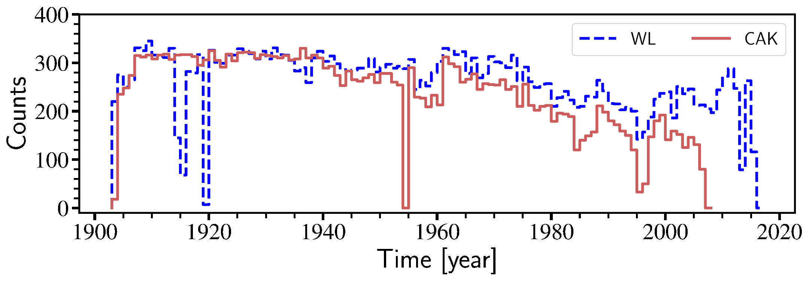
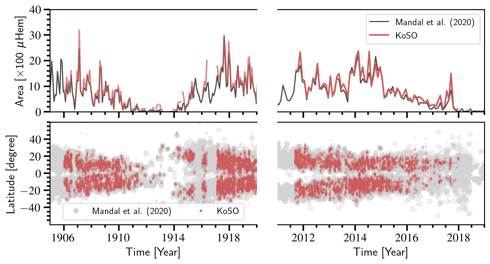
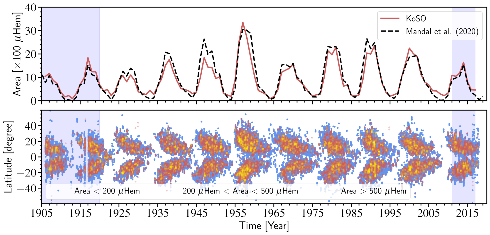
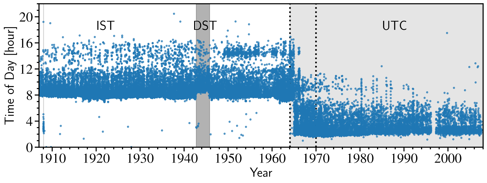
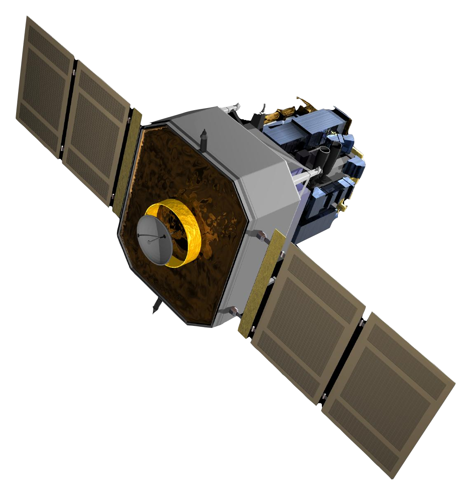

# Data {#Chap2}

::: epigraph
*"The goal is to turn data into information, and information into
insight."*

--Carly Fiorina
:::

The importance of historical archival data is immeasurable for the
long--term study of the Sun. The significance of these data was not out
of the site, and hence observatories around the globe started preserving
them. Most of these data were taken on photographic plates or films,
which are now either digitized or in the process of digitization. Among
all the observatories, the Royal Observatory of Greenwich has one of the
most extended data series from 1874 to 1976, collected and compiled from
its different observing stations. Apart from RGO, Kodaikanal Solar
Observatory, Kodaikanal (1906 onward), Debrecen Photographic Data
(1974--2018), Pulkovo (1932--1991) etc., have systematic sunspot
observation.

<figure id="fig2.1" data-latex-placement="!htbp">
<embed src="Figures/Chapter2/koso.png" style="width:80.0%" />
<figcaption>A fish eyes view of Kodaikanal Solar Observatory
(<em>Image courtesy: KoSO</em>).</figcaption>
</figure>

## The KoSO Digital Archive {#ch1-koso}

Kodaikanal Solar Observatory (KoSO), established in 1899, is one of the
oldest observatories in the world observing the Sun in multi-wavelengths
(white-light, H-alpha, Ca-K) from the beginning of the 20th century
[@Hasan2010]. Earlier, these observations were taken on photographic
plates or films and preserved in the humidity controlled environment at
Kodaikanal. Recently these data have been digitized using a digitizer
unit and made public for the scientific community[^1]. The statistics of
the digitized data is shown in [1.2](#fig2.2){reference-type="ref+label"
reference="fig2.2"}. First, I will briefly discuss the telescope used to
acquire these observations and the digitizer unit used to make it
digital before I get into the details the data products.

<figure id="fig2.2" data-latex-placement="!t">

<figcaption>No of observation at KoSO (red) white-light and (blue)
Ca-K.</figcaption>
</figure>

### The Telescope {#ch2-tele}

The white light observation at Kodaikanal has been performed using an
equatorially mounted 10 cm, f/15 telescope from the begging of 1904.
With the help of additional optics, this telescope produces a solar
image of a diameter of 20.4 cm, which is acquired on a photographic
plate or film. In 1918 this 10 cm lens was replaced by a 15 cm
achromatic lens, and then onward, the same setup is used for the
observation [@Sivaraman1993].

The Ca-K (393.37 nm) and H-alpha (656.28 nm) observations were taken
using a spectroheliograph. To fed the reflected sunlight to the
spectrograph, an 18 inches single mirror siderostat is used along with
the additional optics. The siderostat also take care of the Earth's
rotation and reflect the sunlight in a fixed direction which is fed to
the spectroheliograph. In the spectrograph a two prisms/mirrors along
with CA-K/H-alpha filter are used to observe the Sun in these two
wavelengths.

### The Digitizer Unit {#ch2-digi}

The digitizer unit available at KoSO is used to digitize the observation
taken on plates/films into 4k$\times$`<!-- -->`{=html}4k resolution.
This unit consists a 1 m diameter spherical uniform light source with a
small opening at the top where plates/films are placed in a holder for
digitization. Light coming from the sphere passes through the plate/film
and is captured by a cryogenic cooled (-100$^\circ$ C) CCD camera to
reduce the dark noise. This camera takes the image with resolution of
4k$\times$`<!-- -->`{=html}4k and with a bit depth of 32-bit and stores
it in Flexible Image Transport System (FITS) format for the use of
scientific community [for further details about the digitization see
@Ravindra2013]. This digitizer unit has been extensively used for
digitizing all the photographic plates and films.

## White-light Data {#ch2-wl}

The white--light photographic data for the period 1906--2011 has been
digitized recently using the digitizer discussed in . Barring the period
1906--1920, the white--light data for 1921--2011 has been calibrated and
reported in @Ravindra2013. These calibration steps include (i)
correction for flat field, (ii) disk identification using Hough
transform, (iii) conversion of intensity to relative plate density and
(iv) addition of proper header information as per FITS standard. After
that, a semi--automated sunspot detection technique was developed based
on the already existing sunspot detection algorithm such as STARA
[@Watson2009] to identify the sunspots from these images and these
informations are stored in the form of binary images. The sunspots area
time series extracted from these data have been reported in
@Ravindra2013 and @Mandal2017a. The stored binary mask keeping the
information about sunspots are used in
[\[Chap3\]](#Chap3){reference-type="ref+label" reference="Chap3"}
[@Jha2018; @Jha2019] and [\[Chap4\]](#Chap4){reference-type="ref+label"
reference="Chap4"}[@Jha2021] and could be further used for subsequent
studies.

### Updated Sunspots Area Time Series {#ch2-upwl}

The white-light observation at KoSO started in 1904, but due to
difficulties in calibration for the period 1904, the sunspot area series
has been only reported for the period 1921
[@Ravindra2013; @Mandal2017a]. The initial two years of data (1904 and
1905) have difficulty identifying reference lines that could be used to
get the correct orientation of the images, as they do not contain any.
Therefore, barring the initial two years here, I will briefly discuss
the updated area series, which includes the data for the period 1906 and
extends the series till 2018. The detail report on the update is under
preparation and will be presented in @Jha2022 [in preparation].

<figure id="fig2.3" data-latex-placement="!htbp">

<figcaption> Top: Monthly averaged sunspot area from KoSO with recently
cross-calibrated area series  and bottom: the latitude time diagram,
for the two different epochs.</figcaption>
</figure>

It has been already pointed out by @Ravindra2013 that the configuration
of the telescope has been changed several times before 1918. These
changes result in the varying image quality and disk size on the
photographic plates of films. Along with the East-West line, which is
used to orient the images correctly, these observations contain an
additional North-South line. Due to the presence of two lines, it is not
clear which of these lines correspond to North-South and East-West, and
hence, the older version of codes was unable to deal with these
observations. Now, a semi-automated method is used use manually verify
the orientation of the images based on the movement of features on the
surface. The steps of calibration and sunspot detection is the same as
discussed and also reported in @Ravindra2013. Furthermore, here I also
present the extended area series from the recent period 2011, which are
also extracted in the similar way as discussed in @Ravindra2013 and
@Mandal2017a.

After the detection of sunspots the position of these spots are
extracted. Top panel of [1.3](#fig2.3){reference-type="ref+label"
reference="fig2.3"} shows the monthly averaged sunspot area for the two
different periods (1906 & 2011). The comparison of these monthly
averaged area show a good agreement with the recently cros-calibrated
area series [@Mandal2020]. The bottom panel of
[1.3](#fig2.3){reference-type="ref+label" reference="fig2.3"} also show
the comparison of the position of the detected spots which also in
accordance with @Mandal2020. [1.4](#fig2.4){reference-type="ref+label"
reference="fig2.4"} shows the (top) updated area series from the KoSO
along with the cross-calibrated yearly averaged area from @Mandal2020,
and (bottom) location of sunspots on the surface in form of latitude
time diagram.

<figure id="fig2.4" data-latex-placement="!t">

<figcaption>The updated area time series from the KoSO digital archive
along with the location of sunspots shown in the form of butterfly
diagram.</figcaption>
</figure>

## Ca-K Data {#ch2-cak}

The Ca-K observation captures the chromosphere and carries an important
information about the magnetic nature of the Sun. Ca-K data is used as
an important proxy for the magnetic field measurement. Moreover, this
data also plays a crucial role in the historical reconstruction of solar
irradiance. Therefore, analogous to white light, the Ca-K data has also
been digitized for the period 1904--2007 and calibrated by following the
similar steps as mentioned in . These data have been taken with the help
of siderostat, a single mirror system, and suffers from rotation of the
field of view (FOV). It is important to correctly locate the solar north
in the image for the scientific use of the data. Therefore, after the
observations, the position of solar North/South has been marked by
double/single dot based on the tabulated value of rotation calculated
from observation time [@Priyal2014b]. It has been recently discovered
that there are a few issues with this marking, and it will be addressed
in the next section.

### Pole Angle Calculation {#ch2-pole}

As mentioned already the siderostat cause the rotation of FOV and hence
the position of solar north rotates 360$^\circ$ in one complete day.
Now, instead of tabulated value I suggest to use the mathematical
formula to calculate the rotation caused by siderostat ($\Theta$), which
is given by $$\begin{equation}
    \Theta = 2\tan^{-1}{\left[ K\tan{\left( \frac{{\rm HA}}{2}\right)}\right]};
    \label{eq2.1}
\end{equation}$$ where, $$\begin{equation*}
    K \equiv \frac{\sin{\left( \frac{L-\delta}{2}\right)}}{\sin{\left( \frac{L+\delta}{2}\right)}},
\end{equation*}$$

HA is the hour angle[^2] of the Sun at the time of observation, $L$
(10.23$^\circ$N for KoSO) is the latitude of the observatory and,
$\delta$ ($=90^o - {\rm declination~of~Sun}$) is the pole angle of the
Sun [@Cornu1900]. The mathematical relation given in
[\[eq2.1\]](#eq2.1){reference-type="ref+label" reference="eq2.1"}
depends on HA, which need a correct time of observation ().

### Issues with Timestamps

The  are usually written on plates/films, envelops containing the plate
and in the logbook. During the digitization of these observations, the
file name[^3] is given as par the . To use the digitized images and get
the correct position of solar North, we need this time from the
filenames and here come the problems. There are a few issues with the
timestamp in the filename, which are following.

1.  A major change in time zone from IST (+05:30 GMT) to UTC (00:00 GMT)
    in February 1964 (see [1.5](#fig2.5){reference-type="ref+label"
    reference="fig2.5"}) is noticed and it can straightly corrected.

2.  During Sep 1, 1942 to Oct 15, 1945 there is a systematic shift of a
    hour daylight saving time[^4] (DST; +06:30 UTC) observed in India.
    It is also very easy to be taken care once known.

3.  A careful look at the  in Jan 1908 (for a small period) suggests
    that the  is in UTC, which is again easy to compensate.

4.  Scatters from 1964 to 1970 is mainly due to mixing time zones (IST
    and UTC) during digitization and renaming the files even though the
     on plates are in UTC. Because of its randomness it is little tricky
    to correct.

5.  Scatters seen beyond the usual observation time (06:30 to 17:00 IST)
    is primarily due to the mistake in the name of files during
    digitization.

The points raised in 1, 2 and 3 are straight forward to bring to either
IST or GMT, whatever one may prefer. The scatter and the mistakes in
renaming the file are really difficult to correct because of its random
nature. It was unknown that how much data is effected by such mistakes
and it becomes important to first identify that fraction of data and
then try to correct them if possible.

<figure id="fig2.5" data-latex-placement="!t">

<figcaption>Time of observation of the day as extracted from the
filename with .</figcaption>
</figure>

### Identification and Correction

To identify the in-correct timestamp in the filenames (observations)
these steps have been followed.

1.  Three consecutive observations (images) have been selected and
    rotated based on the  as extracted from filename and using
    [\[eq2.1\]](#eq2.1){reference-type="ref+label" reference="eq2.1"}.

2.  The preceding/following observations are differentially forward/back
    rotated to match with the  of central observation.

3.  Using a fixed threshold, the contours (represents the chromospheric
    feature) of differentially forward/back rotated preceding/following
    observation are overlapped and compared manually with central
    observation.

4.  If either of the contours shows correct overlap, the central
    observation is marked as correct timestamp or  and if non of them
    are overlapping it is marked as in-correct.

5.  Observation marked in-correct are again compared with the two
    correctly marked near-time observations and marked again as Step-4.

I have gone through all the observations, and based on the method
briefed above, the summary is presented in
[1.1](#tab2.1){reference-type="ref+label" reference="tab2.1"}

::: {#tab2.1}
  Number of Observations            Number
  ------------------------- --- ---------------
  Total (1907)               :       47935
  Correct timestamp (IST)    :   31911 (66.6%)
  Correct timestamp (UTC)    :   11654 (24.3%)
  In-Correct timestamp       :   04370 (09.1%)

  : A brief statistics of the number of images with correct and
  in-correct timestamps.
:::

To correct all those observations identified as in-correct timestamps,
we check the plates and logbooks for the . After noting down  for all
the observations, I again check for their correctness using a similar
approach explained earlier. Hence, the final statistics for the
observation with correct and in-correct  is as in
[1.2](#tab2.2){reference-type="ref+label" reference="tab2.2"}. Apart
from these, there are around 720 observations during the period 1904, in
which no  information is available, and I am currently exploring the
possiblity to get the  in those observations. This complete work will be
submitted soon to the Journal of Solar Physics as Jha et al. (2022).

::: {#tab2.2}
  Number of Observations                  Number
  ------------------------------- --- ---------------
  Total (1907)                     :       47935
  Correct                          :   44977 (93.8%)
  In-Correct                       :   01607 (03.4%)
  Bad Quality (visually) Images    :   01150 (02.4%)
  Unknown                          :   00207 (00.4%)

  : A brief statistics of the number of final images with correct and
  in-correct .
:::

## The Michelson Doppler Imager {#ch2-mdi}

The Michelson Doppler Imager [MDI; @Scherrer1995] is a space-based
instrument onboard Solar and Heliospheric Observatory (SOHO, shown in
[1.6](#fig2.6){reference-type="ref+label" reference="fig2.6"}) launched
in December 1995, which is a project of international collaboration
between The National Aeronautics and Space Administration (NASA) and
European Space Agency (ESA). MDI observes the Sun in visible light
(6768 Å; white-light or intensity continuum) with a cadence of 6 hr and
resolution of 4" on 1k$\times$`<!-- -->`{=html}1k CCD. This provides the
photospheric observation of the Sun, which is helpful for the study of
sunspots and other photospheric activity. MDI also measures the line of
sight (LOS) magnetic field component using Zeeman splitting of
magnetically sensitive Ni I 6768 Åline. These LOS magnetograms are
available with the cadence of 96 m and have the exact resolution as
white-light. In this thesis work, the intensity continuum and
magnetogram data have been used for 1996.

<figure id="fig2.6" data-latex-placement="!htbp">

<figcaption>Image of SOHO (<em>Image Courtesy: ESA &amp;
NASA</em>).</figcaption>
</figure>

## The Helioseismic and Magnetic Imager {#ch2-hmi}

The Helioseismic and Magnetic Imager [HMI; @Schou2012] onboard Solar
Dynamic Observatory (SDO) is a succesor of MDI with better resolution
and cadence. It has two 4k$\times$`<!-- -->`{=html}4k CCD cameras which
observe the Sun with 45 sec and 720 sec cadence. HMI provides the full
disk LOS and vector magnetic filed measurementsa and it also provides
the full disk intensity continuum with the resolution of 1". In this
thesis the intensity continum and magnetogram data for the period 2010
has been used.

<figure id="fig2.7" data-latex-placement="!htbp">

<figcaption>SDO (<em>Image Courtesy:
NASA)</em>)</figcaption>
</figure>

[^1]: <https://kso.iiap.res.in/new/data>

[^2]: To calculate hour angle of the sun we have used a IDL routine in
    SolaSoftWare (SSW) *sunpos.pro* and *eq2hor.pro* along with the
    Longitude of the Observatory as 77.46$^\circ$E.

[^3]: filename is given as CAK_19100114T084400_Q1L0a.fits.

[^4]: <https://www.timeanddate.com/time/zone/india/kolkata>
