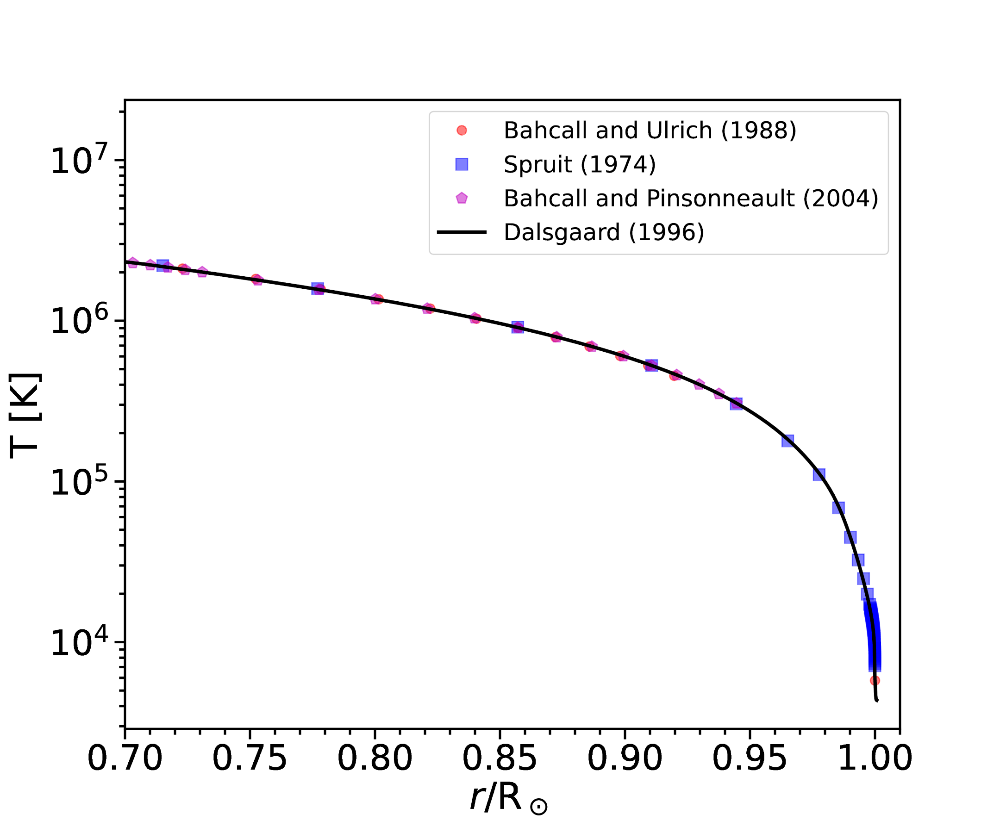
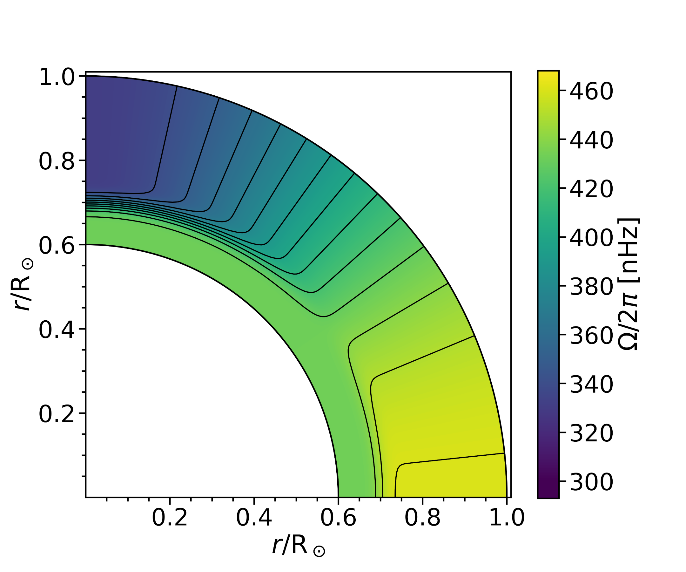
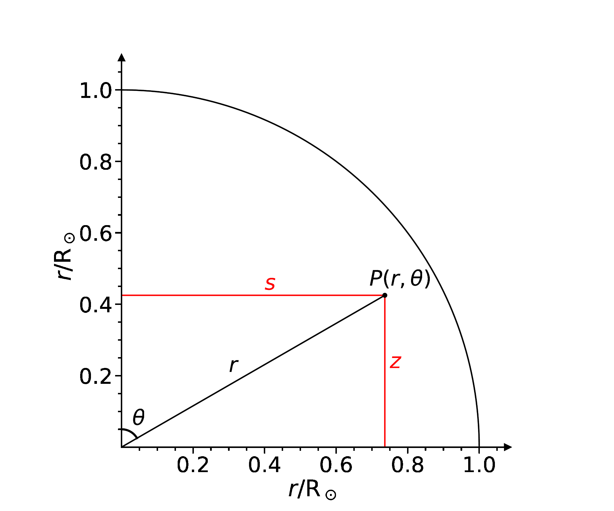
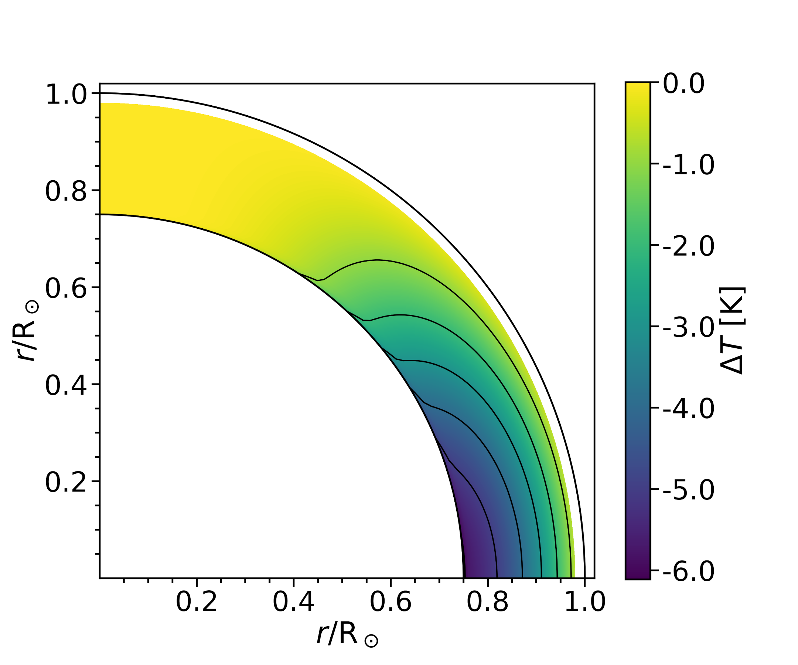
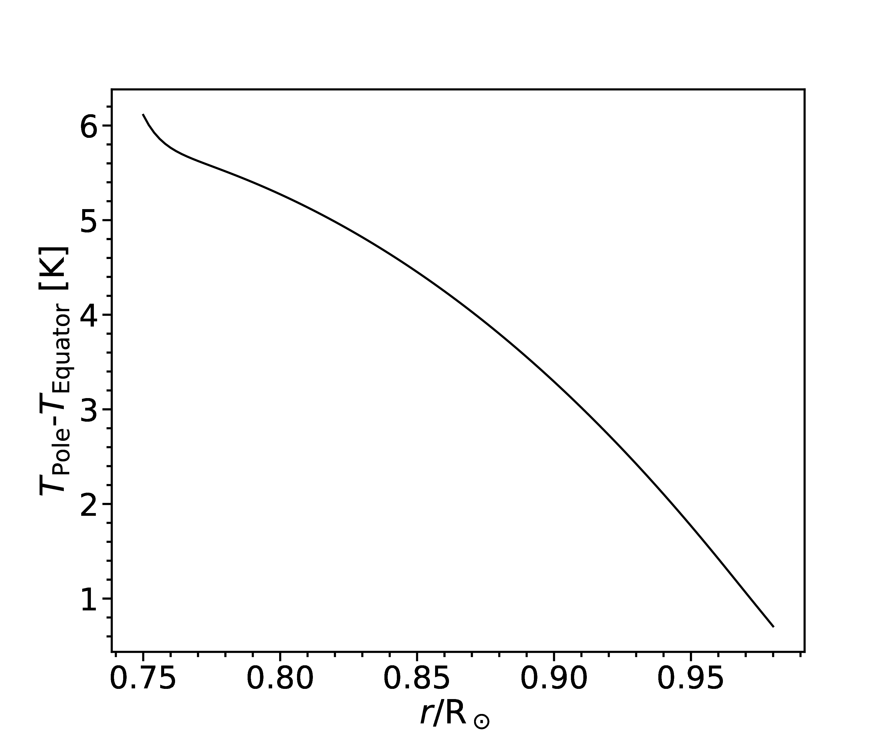
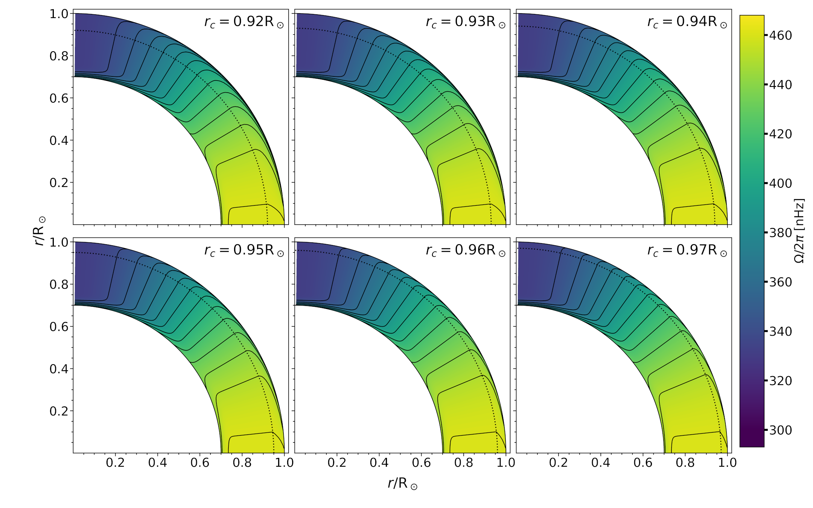
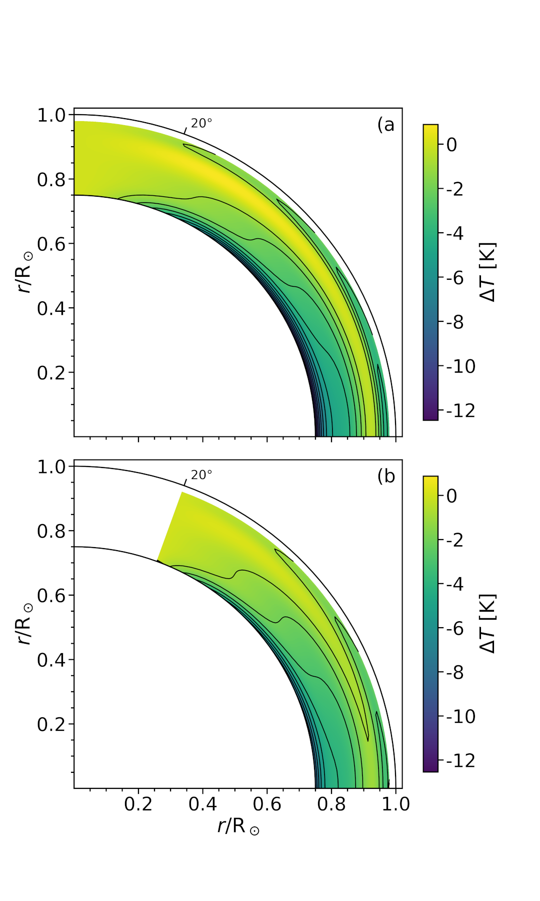
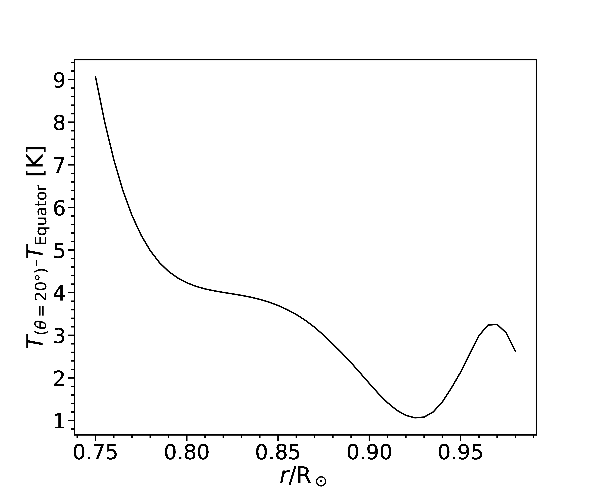
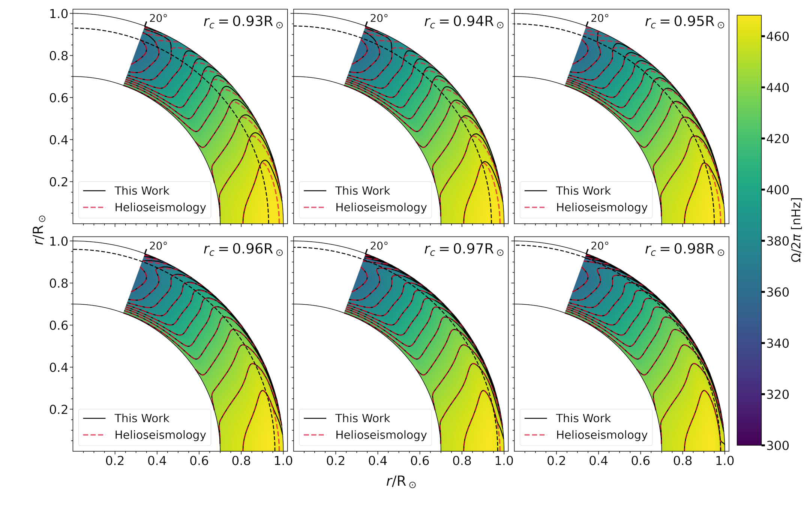
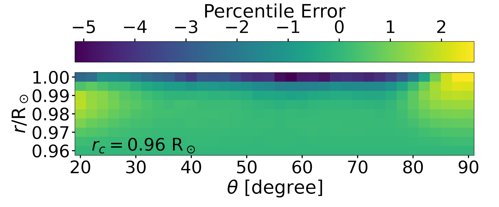

# A Theoretical Model of the Near--Surface Shear Layer of the Sun {#Chap5}

## Introduction {#ch5:intro}

One of the intriguing features in the differential rotation map of the
Sun, as seen, for example, in Figure 1 of @Howe2009 or in Figure 26 of
@Basu2016, is the existence of the near-surface shear layer (NSSL). This
is a layer near the solar surface at the top of the convection zone,
within which the angular velocity decreases sharply with increasing
solar radius. The first indication of the existence of such a layer came
more than half a century ago, when it was noted that the rotation rate
of the solar surface measured from the Doppler shifts of photospheric
spectral lines was about 5% lower than the rotation rate inferred from
the positions of sunspots on the solar surface [@Howard1970]. While the
depth at which sunspots are anchored remains unclear and probably
changes with the age of a sunspot group [@Longcope2002], the rotation
rate inferred from the sunspots was assumed to correspond to a layer
underneath the solar surface, implying that the angular velocity was
higher in that layer. When helioseismology mapped the internal
differential rotation of the Sun, the existence of this layer was fully
established. [1.1](#ch5:fig1){reference-type="ref+label"
reference="ch5:fig1"} shows the differential rotation map of the Sun
obtained by helioseismology (with contours of constant angular velocity)
which we shall use later in our calculations in
Section [1.4](#ch5:helio){reference-type="ref" reference="ch5:helio"}.
The contours of constant angular velocity, which are nearly radial
within a large part of the body of the solar convection zone, bend
towards the equator within a layer of thickness of order
$\approx 0.05$at the top of the convection zone [@Schou1998; @Howe2005].

{#ch5:fig1
width="\\columnwidth"}

What causes this NSSL is still not properly understood. The first
attempts to explain it [@Foukal1975; @Gilman1979] were based on the idea
that convection in the upper layers of the convection zone mixes angular
momentum in such a manner that the angular momentum per unit mass tends
to become constant in these layers, leading to a decrease of the angular
velocity with radius. Once the differential rotation of the Sun was
properly mapped and no evidence was found for the constancy of the
specific angular momentum within the convection zone, it was realized
that this could not be the appropriate explanation. Within the last few
years, there have been attempts to explain the NSSL on the basis of
numerical simulations of the solar convection
[@Guerrero2013; @Hotta2015; @Matilsky2019]. It has been argued by
@Hotta2015 that the Reynolds stresses play an important role in creating
the NSSL, whereas @Matilsky2019 suggested that the steep decrease in
density in the top layers of the convection zone is crucial in giving
rise to the NSSL. @Choudhuri2021a has recently proposed a possible
alternative theoretical explanation of the NSSL based on
order-of-magnitude estimates. The aim of the present paper is to
substantiate the ideas proposed by @Choudhuri2021a through detailed
calculations.

The theories of the two large-scale flow patterns within the convection
zone of the Sun---the differential rotation and the meridional
circulation---are intimately connected with each other
[@Kitchatinov2013; @Choudhuri2021b]. The idea we wish to develop follows
from the central equation in the theory of the meridional circulation:
the thermal wind balance equation. Since the nature of the Coriolis
force arising out of the solar rotation varies with latitude, the effect
of this force on the convection is expected to vary with latitude
[@Durney1971; @Belvedere1976]. Since the Coriolis force provides the
least hindrance to convective heat transport in the polar regions, the
poles of the Sun are expected to be slightly hotter than the equator
[@Kitchatinov1995]. There are some observational indications that this
may indeed be the case [@Kuhn1988; @Rast2008]. Hotter poles would tend
to drive what is called a thermal wind, i.e. a meridional circulation
which would be equatorward at the solar surface. Since the observed
meridional circulation is the opposite of that, we must have another
effect which overpowers this and drives the meridional circulation in
the poleward direction at the surface as observed. It is easy to show
that the centrifugal force arising out of the observed differential
rotation of the Sun can do this job: see Figure 8 and the accompanying
text in @Choudhuri2021b. The term corresponding to the dissipation of
the meridional circulation is found to be negligible compared to the
driving terms within the bulk of the convention zone, as pointed out in
the Appendix of @Choudhuri2021b. As a result, we expect the two driving
terms of the meridional circulation---the thermal wind term and the
centrifugal term---to be comparable within the main body of the solar
convection zone. This is often referred to as the thermal wind balance
condition.

It is generally believed that the thermal wind balance condition holds
within the body of the convection zone [@Kitchatinov2013; @Karak2014a],
although different authors may not completely agree as to the extent to
which it holds [@Brun2010]. There is, however, not much agreement among
different authors whether the thermal wind condition should hold even
within the top upper layer of the solar convection zone. A widely held
view is that this upper layer is a kind of boundary layer within which
the dissipation term or Reynolds stresses become important, giving rise
to a violation of the thermal wind balance condition. It is argued that
the NSSL arises in some manner out of this violation. A completely
opposite argument is given in the earlier paper by @Choudhuri2021a and
in the present paper. We point out that the thermal wind term becomes
very large in the top layer of the solar convection zone due to a
combination of two factors: (i) the temperature falls sharply as we move
outward through this layer, and (ii) the pole-equator temperature
difference does not vary with depth in this layer because of the reduced
effect of the Coriolis force on convection in this layer, as explained
in the next section (Section [1.2](#ch5:method){reference-type="ref"
reference="ch5:method"}). The dissipation term is much smaller than the
thermal wind term even within the main body of the convection zone, as
the order of magnitude estimate in the Appendix of @Choudhuri2021a
suggests. If the thermal wind term becomes even much larger in the upper
layers of the convection zone, then it appears unlikely to us that this
large thermal wind term can be balanced by the dissipation term. The
only possibility is that the centrifugal term also has to become very
large in the top layer to balance the thermal wind term. This dictates
that the top layer has to be a region within which the angular velocity
undergoes a large variation. We show through quantitative calculations
that the structure of the NSSL calculated theoretically on the basis of
our ideas agrees with the observational data remarkably well.

We explain our basic methodology in the next section
(Section [1.2](#ch5:method){reference-type="ref"
reference="ch5:method"}). After that
Section [1.3](#ch5:empirical){reference-type="ref"
reference="ch5:empirical"} is devoted to the applying our methodology to
an analytical expression of the differential rotation in the interior of
the solar convection zone. Then the actual data of differential rotation
obtained by helioseismology are applied to calculate the structure of
the NSSL in Section [1.4](#ch5:helio){reference-type="ref"
reference="ch5:helio"}. Finally, our conclusions are summarized in
Section [1.5](#ch5:conclusion){reference-type="ref"
reference="ch5:conclusion"}.

## Basic Methodology {#ch5:method}

The equation for thermal wind balance is $$\begin{equation}
r \sin{\theta} \frac{\pa}{\pa z} \Omega^2=\frac{1}{r}\frac{g}{\gamma C_V} \frac{\pa S}{\pa \theta},
\label{ch5:eq1}
\end{equation}$$ where $\Omega$ is the angular velocity, $z$ is the
distance from the equatorial plane measured upward, $g$ is the
acceleration due to gravity of the Sun at the point under consideration
and $\gamma$ is the adiabatic index, while $S$ and $C_V$ are
respectively the entropy and the specific heat of the gas per unit mass.
See @Choudhuri2021b for the derivation and a discussion of this
equation.

Over any isochoric surface, the entropy and temperature differentials
between two points are related by $$\begin{equation}
\Delta S = C_V \frac{\Delta T}{T},
\label{ch5:eq2}
\end{equation}$$ We also point out in
Appendix [\[ch5:appn\]](#ch5:appn){reference-type="ref"
reference="ch5:appn"} that
Equation [\[ch5:eq1\]](#ch5:eq1){reference-type="ref"
reference="ch5:eq1"} and
Equation [\[ch5:eq2\]](#ch5:eq2){reference-type="ref"
reference="ch5:eq2"} give the following equation for the temperature
differences on isochoric surfaces $$\begin{equation}
r^2 \sin \theta \frac{\pa}{\pa z} \Omega^2 = \frac{g}{\gamma T} \left( \frac{\pa}{\pa \theta} \Delta T \right)_{\rm isochore}.
\label{ch5:eq3}
\end{equation}$$ This is the main equation on which the analysis of the
present paper is based. Since the oblateness of isochoric surfaces in
the Sun is so small, they can be regarded as spherical surfaces for most
practical purposes. However, from a conceptual point of view, it is
important to remember that our central equation
(Equation [\[ch5:eq3\]](#ch5:eq3){reference-type="ref"
reference="ch5:eq3"}) refers to temperature variations over isochoric
surfaces and that is what gives the possibility of comparing our
theoretical results with observational data of the solar surface.

In our discussions, we sometimes will have to deal with situations like
the following. We may know the distribution of $\Omega (r, \theta)$ in
some region. Suppose we also know the temperature on some axis
$\theta = \theta_0$, which means that we would know the value of the
temperature at one point on a spherical surface. From this, we want to
find the temperature at other points. According to
Equation [\[ch5:eq3\]](#ch5:eq3){reference-type="ref"
reference="ch5:eq3"}, the temperature difference between the points
$(r, \theta)$ and $(r,\theta_0)$ is given by $$\begin{equation}
\Delta T_{\theta_0} (r, \theta) = \frac{r^2 \gamma}{g}
\int_{\theta_0}^{\theta} d\theta \; T
\sin \theta \frac{\pa}{\pa z} \Omega^2.
\label{ch5:eq34}
\end{equation}$$ As stressed earlier by @Choudhuri2021a
[@Choudhuri2021b], whether the Coriolis force due to the Sun's rotation
has any effect on the convection cells depends on whether the convective
turnover time is comparable to the rotation period or not. Numerical
simulations suggest that convection in the deeper layers of the
convection zone involves large convection cells with long turnover times
and are affected by the Coriolis force: see Figure 1 in @Brown2010 or
Figure 3 in @Gastine2014. As a result, heat transfer depends on
latitude. However, this is not the case near the top of the convection
zone, where the convection cells (the granules) are much smaller in size
and have turnover times as short as a few minutes. The extent to which
the temperature gradient $d T/ dr$ differs from the adiabatic gradient
depends on the mixing length (see, for exmaple, @Kippenhahn1990,
Section 7). In the top of the convection zone which is not affected by
rotation, the mixing length is independent of latitute and we expect
$d T/ dr$ also to be independent of latitude [@Choudhuri2021a]. Although
there must be a gradual transition from deeper layers within which heat
transport depends on the latitude to the top layer within which this is
not the case, we assume for simplicity that the transition takes place
at radius $r = r_c$ above which we have $d T/d r$ independent of
latitude. We shall work out our model by assuming different values of
$r_c$ in the range 0.92 -- 0.98 .

In the simplest kind of a spherically symmetric model of the Sun, the
temperature $T$ would be function of $r$ alone and would be independent
of $\theta$. If the heat transport depends on latitude, then that would
introduce a small variation of $T$ with $\theta$. We can write
$$\begin{equation}
T(r, \theta) = T (r, 0) + \Delta T (r, \theta).
\label{ch5:eq4}
\end{equation}$$ If $d T/ dr$ is independent of latitude in the layer
above $r > r_c$, then we have $$\begin{equation}
\frac{dT (r,\theta)}{dr} = \frac{dT (r,0)}{dr} \nonumber
\end{equation}$$ so that it follows from
Equation [\[ch5:eq4\]](#ch5:eq4){reference-type="ref"
reference="ch5:eq4"} that $$\begin{equation}
\frac{d}{dr} \Delta T (r, \theta)= 0 \nonumber
\end{equation}$$ in this top layer. So we can write $$\begin{equation}
\Delta T (r > r_c, \theta) = \Delta T (r_c, \theta).
\label{ch5:eq5}
\end{equation}$$ In principle, it would be possible to determine
$T (r, \theta)$ throughout the convection zone if we have a theory of
how convective heat transport varies with latitude due to the effect of
the Coriolis force. Since our understanding of this complex problem is
limited, we can proceed in a different manner. Since there is general
agreement that the thermal wind balance condition holds within the
deeper layers of the convection zone, we assume
Equation [\[ch5:eq3\]](#ch5:eq3){reference-type="ref"
reference="ch5:eq3"} to hold below the radius $r = r_c$. If we know the
angular velocity $\Omega (r, \theta)$ in this region, then it is
straightforward to evaluate the left hand side of
Equation [\[ch5:eq3\]](#ch5:eq3){reference-type="ref"
reference="ch5:eq3"}. Once we have the value of the left hand side, we
can carry on integration in accordance with
Equation [\[ch5:eq34\]](#ch5:eq34){reference-type="ref"
reference="ch5:eq34"} to determine $\Delta T (r, \theta)$ at all points
within the convection zone below $r = r_c$. Once we have the value of
$\Delta T (r, \theta)$ at the radius $r = r_c$, we readily have the
value of $\Delta T (r, \theta)$ at all points above this surface by
using Equation [\[ch5:eq5\]](#ch5:eq5){reference-type="ref"
reference="ch5:eq5"}. In other words, we can obtain
$\Delta T (r, \theta)$ throughout the convection zone from the values of
$\Omega (r, \theta)$ in the deeper layers below $r = r_c$, where
Equation [\[ch5:eq3\]](#ch5:eq3){reference-type="ref"
reference="ch5:eq3"} is expected to hold. Comparing
Equation [\[ch5:eq34\]](#ch5:eq34){reference-type="ref"
reference="ch5:eq34"} with
Equation [\[ch5:eq5\]](#ch5:eq5){reference-type="ref"
reference="ch5:eq5"}, it should be clear that $\Delta T (r, \theta)$ is
nothing but $\Delta T_{\theta_0} (r, \theta)$ with $\theta_0 = 0$.

As we already pointed out, there is a lack of consensus whether the
thermal wind balance equation holds in the top layer of the convection
zone. It follows from
Equation [\[ch5:eq5\]](#ch5:eq5){reference-type="ref"
reference="ch5:eq5"} that $(\pa/\pa \theta) \Delta T (r,\theta)$ does
not vary with $r$ above the radial surface $r = r_c$. On the other hand,
the temperature scale height becomes very small in this top layer and
the temperature falls by orders of magnitude as we move to the solar
surface from $r = r_c$. As a result, the thermal wind term represented
by the right hand side of
Equation [\[ch5:eq3\]](#ch5:eq3){reference-type="ref"
reference="ch5:eq3"} in which $T$ appears in the denominator becomes
very large. We do not think that this term can be balanced by the
dissipation term. We suggest that the thermal wind balance must hold
even in this top layer and the centrifugal term represented by left hand
side of Equation [\[ch5:eq3\]](#ch5:eq3){reference-type="ref"
reference="ch5:eq3"} has to become very large to balance the thermal
wind term, implying a strong variation of $\Omega^2$ along $z$. As we
have the values of $\Delta T$ above $r = r_c$, we can evaluate the right
hand side of Equation [\[ch5:eq3\]](#ch5:eq3){reference-type="ref"
reference="ch5:eq3"} easily. Then we can use
Equation [\[ch5:eq3\]](#ch5:eq3){reference-type="ref"
reference="ch5:eq3"} to determine how $\Omega^2$ varies within this top
layer.

In a nutshell, our methodology is as follows. We start by assuming a
value of $r = r_c$ below which convective heat transport is affected by
the Coriolis force and above which this is not the case. To begin with,
we need the value of $\Omega (r, \theta)$ below $r_c$, from which we can
calculate the left hand side of
Equation [\[ch5:eq3\]](#ch5:eq3){reference-type="ref"
reference="ch5:eq3"} and eventually obtain $\Delta T (r, \theta)$
throughout the solar convection zone, obtaining $\Delta T (r, \theta)$
above $r_c$ by using
Equation [\[ch5:eq5\]](#ch5:eq5){reference-type="ref"
reference="ch5:eq5"}. Once we have $\Delta T (r, \theta)$ above $r_c$,
the right hand side of
Equation [\[ch5:eq3\]](#ch5:eq3){reference-type="ref"
reference="ch5:eq3"} can be evaluated, which enables us to find out
$\Omega (r, \theta)$ above $r_c$ from
Equation [\[ch5:eq3\]](#ch5:eq3){reference-type="ref"
reference="ch5:eq3"}. Although we use
Equation [\[ch5:eq3\]](#ch5:eq3){reference-type="ref"
reference="ch5:eq3"} for all our calculations, we proceed differently
below and above $r = r_c$. Below $r_c$ we calculate
$\Delta T (r, \theta)$ from $\Omega (r, \theta)$ beginning with the left
hand side of Equation [\[ch5:eq3\]](#ch5:eq3){reference-type="ref"
reference="ch5:eq3"}, whereas above $r_c$ we calculate
$\Omega (r, \theta)$ from $\Delta T (r, \theta)$ beginning with the
right hand side of Equation [\[ch5:eq3\]](#ch5:eq3){reference-type="ref"
reference="ch5:eq3"}.

The earlier paper by @Choudhuri2021a presented some order-of-magnitude
estimates based on the methodology outlined above. Now we present a
detailed analysis. It order to carry on this analysis, we need the
values of the temperature as a function of $r$, which we can take to be
$T(r, 0)$, i.e. temperature values on the polar axis where the effect of
the Coriolis force is minimal. Several models of the convection zone
exist in the literature
[@Spruit1974; @Bahcall1988; @Dalsgaard1996; @Bahcall2004]. We use what
has been referred to as Model S by @Dalsgaard1996 to obtain $T$ at
different values of $r$. Actually, all the models of the convection zone
give very similar $T(r)$, as can be seen in
[1.2](#ch5:fig2){reference-type="ref+label" reference="ch5:fig2"}. We
also note the sharp fall of the temperature in the outer layers of the
convection zone, which is of crucial importance in our theory. The
thermal wind term appearing in
Equation [\[ch5:eq3\]](#ch5:eq3){reference-type="ref"
reference="ch5:eq3"} has $T$ in the denominator and becomes very large
in the uppermost layers of the convection zone. The value of the
adiabatic index $\gamma$ is taken to be 5/3 in all our calculations. We
point out that, in Model S, the value of $\gamma$ is very close to 5/3
throughout the convection zone except in the top layer 0.97--, where it
becomes somewhat less due to the variations in the level of hydrogen
ionization. We also need the values of $\Omega (r, \theta)$ below
$r = r_c$ to start our calculations. Calculations based on an analytical
expression of $\Omega (r, \theta)$ which fits helioseismology
observtions reasonably well are presented in
Section [1.3](#ch5:empirical){reference-type="ref"
reference="ch5:empirical"}. Then
Section [1.4](#ch5:helio){reference-type="ref" reference="ch5:helio"}
will present calculations done with the actual helioseismology data of
differential rotation $\Omega (r, \theta)$ used below $r_c$.
Calculations of both Section [1.3](#ch5:empirical){reference-type="ref"
reference="ch5:empirical"} and
Section [1.4](#ch5:helio){reference-type="ref" reference="ch5:helio"}
give the NSSL matching the observational data quite closely for
appropriate values of $r_c$. We point out that the input data of
$\Omega (r, \theta)$ used in both these sections (given by
[\[ch5:eq6\]](#ch5:eq6){reference-type="ref+label" reference="ch5:eq6"}
and from helioseismology respectively) give nearly radial contours till
$r_c$ without much sign of the NSSL below $r_c$. In fact, the analytical
expression of $\Omega (r, \theta)$ that we use does not incorporate the
NSSL at all and gives radial contours till the solar surface. As we get
the NSSL even in this case, we can clearly rule out the possibility that
there might have been some indication about the existence of the NSSL in
the input data which percolated through the calculations to give the
NSSL at the end. There is no doubt that the NSSL arises primarily out of
the requirement that the centrifugal term has to match the thermal wind
term which has become very large in the top layers of the solar
convection zone.

<figure id="ch5:fig2" data-latex-placement="!ht">

<figcaption>Variation of temperature with <em>r</em> in different convection zone
models. The curve corresponds to Model S used in our calculations.
</figcaption>
</figure>

It may be mentioned that @Matilsky2020 calculated the temperature
difference $\Delta T$ which one would get from the solar differential
rotation by assuming the thermal wind balance
Equation [\[ch5:eq3\]](#ch5:eq3){reference-type="ref"
reference="ch5:eq3"} to be valid till the top of the convection zone and
plotted it in Figure 13 of their paper. However, they did not discuss
any physical significance of this. Some related issues are also
discussed in a recent paper by @Vasil2020.

## Results Based on Analytical Expression {#ch5:empirical}

As pointed out in Section [1.2](#ch5:method){reference-type="ref"
reference="ch5:method"}, we need the values of $\Omega (r,\theta)$ below
$r<r_c$ to start our calculations. In this section, we present the
results of our calculations based on the following analytical expression
of $\Omega (r,\theta)$ which fits the helioseismology observations
closely [@Schou1998; @Charbonneau1999]: $$\begin{equation}
    \Omega(r,\theta)= \Omega_{\rm RZ}+ \frac{1}{2}\left[1-{\rm erf}\left(\frac{r-r_t}{d_t}\right)\right] \left[\Omega_{\rm SCZ}(\theta)-\Omega_{\rm RZ}\right],
    \label{ch5:eq6}
\end{equation}$$ where $r_t=0.7$, $d_t=0.025$,
$\Omega_{\rm RZ}/2\pi=432.8$ nHz and
$\Omega_{\rm SCZ}(\theta)/2\pi=\Omega_{\rm EQ}+\alpha_2\cos^2(\theta)+\alpha_4\cos^4(\theta)$,
with $\Omega_{\rm EQ}/2\pi= 460.7$ nHz, $\alpha_2/2\pi=-62.69$ nHz and
$\alpha_4/2\pi=-67.13$ nHz. [1.3](#ch5:fig3){reference-type="ref+label"
reference="ch5:fig3"} shows the rotation profile obtained from
[\[ch5:eq6\]](#ch5:eq6){reference-type="ref+label" reference="ch5:eq6"}
along with contours of constant $\Omega$ (solid black lines). We note
the absence of any signature of NSSL. On comparing with
Figure [1.1](#ch5:fig1){reference-type="ref" reference="ch5:fig1"}
giving the rotation profile based on helioseismology data, we see that
the analytical expression gives a reasonable fit to the data in the
deeper layers of the convection zone.

<figure id="ch5:fig3" data-latex-placement="!ht">

<figcaption>Rotation profile calculated by using the analytical
expression (Equation <a href="#ch5:eq6" data-reference-type="ref"
data-reference="ch5:eq6">[ch5:eq6]</a>). The contours correspond to
values of <em>Ω</em> at the interval of
10 nHz, the extreme contours being for the values 340 nHz and 460
nHz.</figcaption>
</figure>

As explained in Section [1.2](#ch5:method){reference-type="ref"
reference="ch5:method"}, our first step is to obtain
$\Delta T (r, \theta)$ for $r<r_c$ by making use of
[\[ch5:eq3\]](#ch5:eq3){reference-type="ref+label" reference="ch5:eq3"},
in which the left hand side is evaluated by using $\Omega (r, \theta)$
as given by [\[ch5:eq6\]](#ch5:eq6){reference-type="ref+label"
reference="ch5:eq6"}. To calculate the left side of
[\[ch5:eq3\]](#ch5:eq3){reference-type="ref+label" reference="ch5:eq3"},
we need to evaluate the derivative of $\Omega^2$ along the $z$
direction. For this purpose, we use the transformation equation
$$\begin{equation}
    \left(\frac{\partial}{\partial z}\right)_s=\left(\frac{\partial r}{\partial z}\right)_s\frac{\partial}{\partial r}-\left(\frac{\partial \theta}{\partial z}\right)_s\frac{\partial}{\partial \theta}=\cos{\theta}\frac{\partial}{\partial r}-\frac{\sin{\theta}}{r}\frac{\partial}{\partial \theta},
    \label{ch5:eq7}
\end{equation}$$ on making use of $s=r\cos{\theta}$ and
$z=r\sin{\theta}$ (shown in [1.4](#ch5:fig4){reference-type="ref+label"
reference="ch5:fig4"}). We need to choose a particular value of $r_c$.
We are going to present discussions for values of $r_c$ in the range
0.92  -- 0.97 . We now use
[\[ch5:eq34\]](#ch5:eq34){reference-type="ref+label"
reference="ch5:eq34"} to calculate $\Delta T (r,\theta)$ in the
convection zone for all values of $r$ below the maximum value 0.98  of
$r_c$ that we consider. We calculate the numerical derivative of
$\Omega^2$ with the help of the transformation
[\[ch5:eq7\]](#ch5:eq7){reference-type="ref+label" reference="ch5:eq7"}
by using the first order divided difference scheme. Then we use the
Runge-Kutta 4th order (RK4) method to solve
[\[ch5:eq3\]](#ch5:eq3){reference-type="ref+label" reference="ch5:eq3"},
which is equivalent to carrying on the integration in
[\[ch5:eq34\]](#ch5:eq34){reference-type="ref+label"
reference="ch5:eq34"}.

<figure id="ch5:fig4" data-latex-placement="!ht">

<figcaption>Relation between spherical co-ordinate system (<em>r</em>, <em>θ</em>) and the other
coordinates (<em>s</em>, <em>z</em>) we
use.</figcaption>
</figure>

[1.5](#ch5:fig5){reference-type="ref+label" reference="ch5:fig5"} shows
the distribution of $\Delta T (r, \theta)$ in the convection zone below
0.98  that would follow on assuming the thermal wind balance and using
$\Omega (r, \theta)$ given by the analytical expression
[\[ch5:eq6\]](#ch5:eq6){reference-type="ref+label" reference="ch5:eq6"}.
We clearly see a decrease in $\Delta T(r,\theta)$ with $r$ as we
approach the surface. Now, one quantity which is of particular interest
to us is the pole-equator temperature difference
$\Delta T(r, \theta=0) - \Delta T(r, \theta=\pi/2)$ as a function of
$r$. Figure [1.6](#ch5:fig6){reference-type="ref+label"
reference="ch5:fig6"} shows this pole-equator temperature difference as
a function of $r$ within the convection zone for $r<0.98$.

<figure id="ch5:fig5" data-latex-placement="!ht">

<figcaption>Profile of <em>Δ</em><em>T</em>(<em>r</em>, <em>θ</em>)
in the solar convection zone below <em>r</em> = 0.98 , which would follow from
the analytical expression (<a href="#ch5:eq6"
data-reference-type="ref+label" data-reference="ch5:eq6">[ch5:eq6]</a>)
on taking <em>r</em><em>c</em> = 0.98 .
Contours represent the constant values of <em>Δ</em><em>T</em>(<em>r</em>, <em>θ</em>).</figcaption>
</figure>

<figure id="ch5:fig6" data-latex-placement="!ht">

<figcaption>The pole-equator temperature difference as a function of
radius, corresponding to Figure <a href="#ch5:fig5"
data-reference-type="ref"
data-reference="ch5:fig5">1.5</a>.</figcaption>
</figure>

We shall now present our results for the NSSL by assuming different
values of $r_c$ in the range 0.92 -- 0.97. For a particular value of
$r_c$, we take $\Delta T (r,\theta)$ to be as given in
[1.5](#ch5:fig5){reference-type="ref+label" reference="ch5:fig5"} for
$r <r_c$ and as given by
[\[ch5:eq5\]](#ch5:eq5){reference-type="ref+label" reference="ch5:eq5"}
for $r >r_c$. In this way, we obtain $\Delta T (r,\theta)$ throughout
the convection zone for a chosen value of $r_c$. We point out that the
observational value of the pole-equator temperature difference reported
by @Rast2008 is $\approx 2.5$ K.
[1.6](#ch5:fig6){reference-type="ref+label" reference="ch5:fig6"} shows
that such a value of the pole-equator temperature difference occurs at
around $r \approx 0.92$ when we evaluate $\Delta T (r, \theta)$ from the
analytical expression
([\[ch5:eq6\]](#ch5:eq6){reference-type="ref+label"
reference="ch5:eq6"}) of $\Omega(r, \theta)$. This means that we have to
take $r_c \approx 0.92$  to get the pole-equator temperature difference
at the surface which matches the observations of @Rast2008.

Now that we have $\Delta T (r,\theta)$ throughout the convection zone
including the top layer ($r\ge r_c$) for different values of $r_c$, the
last step is to calculate $\Omega (r\ge r_c,\theta)$ in this top layer
by assuming that the thermal wind balance holds in this layer. We have
already made use of $\Omega (r < r_c,\theta)$ in the deeper layers of
the convection zone, as given by
[\[ch5:eq6\]](#ch5:eq6){reference-type="ref+label" reference="ch5:eq6"},
to calculate $\Delta T (r,\theta)$ by making use of
[\[ch5:eq34\]](#ch5:eq34){reference-type="ref+label"
reference="ch5:eq34"} (which is effectively the same as
[\[ch5:eq3\]](#ch5:eq3){reference-type="ref+label" reference="ch5:eq3"})
and [\[ch5:eq5\]](#ch5:eq5){reference-type="ref+label"
reference="ch5:eq5"}. We now use the thermal balance
[\[ch5:eq3\]](#ch5:eq3){reference-type="ref+label" reference="ch5:eq3"}
in the top layer ($r\ge r_c$) in a different manner. From the value of
$\Delta T (r\ge r_c,\theta)$ in this top layer, we calculate the right
hand side of [\[ch5:eq3\]](#ch5:eq3){reference-type="ref+label"
reference="ch5:eq3"} and then solve
[\[ch5:eq3\]](#ch5:eq3){reference-type="ref+label" reference="ch5:eq3"}
to find the distribution of $\Omega (r\ge r_c,\theta)$ in this top layer
which would satisfy [\[ch5:eq3\]](#ch5:eq3){reference-type="ref+label"
reference="ch5:eq3"}. We carry on this procedure for the values $r_c =$
0.92 , 0.93 , 0.94 , 0.95 , 0.96 , 0.97 . We can combine
$\Omega (r\ge r_c,\theta)$ obtained in the top layer in this manner with
$\Omega (r < r_c,\theta)$ in the deeper layers as given by
[\[ch5:eq6\]](#ch5:eq6){reference-type="ref+label" reference="ch5:eq6"}.
This combination for the different values of $r_c$ which we have used
are shown in [1.7](#ch5:fig7){reference-type="ref+label"
reference="ch5:fig7"}. The dotted circles in the various sub-figures
indicate the values of $r_c$ for all these cases.

<figure id="ch5:fig7" data-latex-placement="!ht">

<figcaption>The profiles of <em>Ω</em>(<em>r</em>, <em>θ</em>) for
different values of <em>r</em> = <em>r</em><em>c</em>,
obtained by using <em>Ω</em>(<em>r</em>, <em>θ</em>) given by
<a href="#ch5:eq6" data-reference-type="ref+label"
data-reference="ch5:eq6">[ch5:eq6]</a> as input data for <em>r</em> &lt; <em>r</em><em>c</em>
.</figcaption>
</figure>

The contours of constant $\Omega$ bend towards the equator in the top
layers of the convection zone for all values of $r_c$ shown in
[1.7](#ch5:fig7){reference-type="ref+label" reference="ch5:fig7"}. This
indicates the clear presence of the NSSL in all these cases. We stress
again that the initial input data $\Omega (r < r_c,\theta)$ which we had
used in the deeper layers of the convection zone in order to start our
calculations did not have the NSSL. In fact, the analytical expression
([\[ch5:eq6\]](#ch5:eq6){reference-type="ref+label"
reference="ch5:eq6"}), which we had used for the values of
$\Omega (r < r_c,\theta)$ in the deeper layers, does not give rise to
the NSSL at all, as seen in [1.3](#ch5:fig3){reference-type="ref+label"
reference="ch5:fig3"}. It is thus clear that the NSSL that we see in
[1.7](#ch5:fig7){reference-type="ref+label" reference="ch5:fig7"} could
not be an artifact of the input data. The NSSL arises from the fact that
the thermal wind term becomes very large in the top layers due to the
falling temperature there and the centrifugal term also has to become
very large to balance it. This requirement for satisfying the thermal
wind condition ([\[ch5:eq3\]](#ch5:eq3){reference-type="ref+label"
reference="ch5:eq3"}) in the top layer can only be met if there is an
NSSL. We propose this as the explanation for the existence of the NSSL
in the top layer of the solar convection zone. The different sub-plots
in [1.7](#ch5:fig7){reference-type="ref+label" reference="ch5:fig7"}
show that the increase in $r_c$ causes the NSSL to be confined to an
increasingly narrower layer near the solar surface.

## Results Based on Helioseismology Data {#ch5:helio}

After presenting the results based on the analytical expression
Equation [\[ch5:eq6\]](#ch5:eq6){reference-type="ref"
reference="ch5:eq6"} of $\Omega (r, \theta)$ in the previous section
(Section [1.3](#ch5:empirical){reference-type="ref"
reference="ch5:empirical"}), we now carry on exactly the same
calculations based on the value of $\Omega (r, \theta)$ as given by
helioseismology. We use $\Omega (r, \theta)$ averaged over cycle 23, as
supplied to us by H.M. Antia. The methodology that was used for
obtaining the $\Omega (r, \theta)$ profile from helioseismology data has
been described by @Antia1998 [@Antia2008]. Our calculations are based on
the tabulated value of temporally averaged $\Omega (r, \theta)$ for all
$r$ in the range 0.7 to at steps of 0.005 and for all $\theta$ in the
range of $2^{\circ}$ to $90^{\circ}$ ($88^{\circ}$ to $0^{\circ}$
latitude) at steps of $2^{\circ}$. The profile of $\Omega (r, \theta)$
with the contours of constant $\Omega$ (represented as black solid
lines) has been shown in [1.1](#ch5:fig1){reference-type="ref+label"
reference="ch5:fig1"}.

As in Section [1.3](#ch5:empirical){reference-type="ref"
reference="ch5:empirical"}, we carry on calculations for different
values of $r_c$ in the range 0.93  -- 0.98 . For a particular value of
$r_c$, we substitute the values of $\Omega (r < r_c,\theta)$ in the left
hand side of [\[ch5:eq3\]](#ch5:eq3){reference-type="ref+label"
reference="ch5:eq3"} to calculate $\Delta T (r < r_c,\theta)$. The
values of $\Delta T (r,\theta)$ for $r > r_c$ are again given by
[\[ch5:eq5\]](#ch5:eq5){reference-type="ref+label" reference="ch5:eq5"}.
[1.8](#ch5:fig8){reference-type="ref+label" reference="ch5:fig8"}a shows
the profile of $\Delta T(r<r_c,\theta)$ calculated for the case
$r_c = 0.98$ . One concern we have is that the helioseismic
determination of $\Omega (r, \theta)$ has large uncertainties in the
polar regions at high latitudes and, when we use
[\[ch5:eq34\]](#ch5:eq34){reference-type="ref+label"
reference="ch5:eq34"} to calculate $\Delta T (r < r_c,\theta)$, which is
$\Delta T_{\theta_0} (r < r_c,\theta)$ with $\theta_0 = 0$, we have to
integrate over this region where the value of $\Omega (r, \theta)$ is
unreliable. One way of avoiding this difficulty is to consider
temperature variations only in regions not too close to the poles where
we can trust the helioseismic values of $\Omega(r, \theta)$. We have
used [\[ch5:eq34\]](#ch5:eq34){reference-type="ref+label"
reference="ch5:eq34"} to calculate
$\Delta T_{20^{\circ}} (r < r_c,\theta)$ by avoiding the polar region.
[1.8](#ch5:fig8){reference-type="ref+label" reference="ch5:fig8"}b shows
the profile of $\Delta T_{20^{\circ}} (r < r_c,\theta)$. Comparing the
profiles of $\Delta T (r < r_c,\theta)$ for co-latitudes higher than
$20^{\circ}$ (i.e. latitudes lower than $70^{\circ}$) in
[1.8](#ch5:fig8){reference-type="ref+label" reference="ch5:fig8"}a -- b,
we find that various features are in broad agreement, indicating that
they are not due to errors in $\Omega (r, \theta)$ near the polar
region. Especially, we find an annular strip near $r = 0.925 R_{\odot}$
within which the value of $\Delta T (r < r_c,\theta)$ is close to zero
in [1.8](#ch5:fig8){reference-type="ref+label" reference="ch5:fig8"}a.
This strip becomes less prominent in
[1.8](#ch5:fig8){reference-type="ref+label" reference="ch5:fig8"}b,
though it does not disappear. The reason behind this strip is this. On
taking a careful look at [1.1](#ch5:fig1){reference-type="ref+label"
reference="ch5:fig1"}, we realize that $\pa \Omega^2/\pa z$ just below
the NSSL is close to zero at latitudes higher than mid-latitudes and is
even positive at very high latitudes (it is usually negative within the
convection zone). This explains, on the basis of
[\[ch5:eq34\]](#ch5:eq34){reference-type="ref+label"
reference="ch5:eq34"}, why we have this unusual strip even in
[1.8](#ch5:fig8){reference-type="ref+label" reference="ch5:fig8"}b after
excluding the polar region. @Schou1998 refer to this region at high
latitudes somewhat below the surface as "a submerged polar jet" and
comment in Section 5.5 of their paper that it "is seen consistently by
several independent methods". If this submerged polar jet is real and
not a data artifact, then what causes it is certainly an important
question. We do not attempt to address this question in the present
paper.

<figure id="ch5:fig8" data-latex-placement="!ht">

<figcaption>Profile of <em>Δ</em><em>T</em>(<em>r</em>, <em>θ</em>)
in the solar convection zone below <em>r</em> = 0.98, which would follow from
the helioseismology data of differential rotation on taking <em>r</em><em>c</em> = 0.98.
Contours represent the constant values of <em>Δ</em><em>T</em>(<em>r</em>, <em>θ</em>).
(a) shows the profile of <em>Δ</em><em>T</em>0⊙(<em>r</em>, <em>θ</em>)
and (b) the profile of <em>Δ</em><em>T</em>20⊙(<em>r</em>, <em>θ</em>)
as defined in Equation <a href="#ch5:eq34" data-reference-type="ref"
data-reference="ch5:eq34">[ch5:eq34]</a></figcaption>
</figure>

We now plot the temperature difference
$\Delta T (r, \theta=20^{\circ}) - \Delta T (r, \theta=90^{\circ})$
between the co-latitude $20^{\circ}$ (i.e. latitude $70^{\circ}$) and
the equator as a function of $r$ in
[1.9](#ch5:fig9){reference-type="ref+label" reference="ch5:fig9"}. It
should be clear from
[\[ch5:eq34\]](#ch5:eq34){reference-type="ref+label"
reference="ch5:eq34"} that this temperature difference is given by
integrating the integrand in the right hand side of
[\[ch5:eq34\]](#ch5:eq34){reference-type="ref+label"
reference="ch5:eq34"} from $\theta=20^{\circ}$ to $\theta=90^{\circ}$.
In other words, this temperature difference is independent of the values
of $\Omega (r, \theta)$ at very high latitudes (where these values may
have large uncertainties) and should be the same for both the cases
shown in [1.8](#ch5:fig8){reference-type="ref+label"
reference="ch5:fig8"}a and [1.8](#ch5:fig8){reference-type="ref+label"
reference="ch5:fig8"}b. We have seen in the calculations based on the
analytical expression of $\Omega (r, \theta)$ in the previous section
(Section [1.3](#ch5:empirical){reference-type="ref"
reference="ch5:empirical"}) that the pole-equator temperature difference
decreased monotonically with $r$ (see
[1.6](#ch5:fig6){reference-type="ref+label" reference="ch5:fig6"}).
However, [1.9](#ch5:fig9){reference-type="ref+label"
reference="ch5:fig9"} shows a more complicated dependence of a similar
temperature difference on $r$. We indeed find a monotonic decrease of
the temperature difference with $r$ for values of $r$ lower than
$\approx0.92$. But then it starts increasing with $r$ up to
$\approx 0.97$, beyond which it decreases again. This complicated
variation of the temperature difference is connected with the submerged
polar jet which continues even a little bit beyond co-latitude
$20^{\circ}.$

<figure id="ch5:fig9" data-latex-placement="!ht">

<figcaption>The temperature difference between the co-latitude 20∘ and the equator as a function
of radius, corresponding to <a href="#ch5:fig8"
data-reference-type="ref+label"
data-reference="ch5:fig8">1.8</a>.</figcaption>
</figure>

The final step in our analysis is exactly the same as in
Section [1.3](#ch5:empirical){reference-type="ref"
reference="ch5:empirical"}. Once we have $\Delta T (r, \theta)$
throughout the convection zone corresponding to different values of
$r_c$ (with its value for $r \ge r_c$ being given by
[\[ch5:eq5\]](#ch5:eq5){reference-type="ref+label"
reference="ch5:eq5"}), we evaluate the right hand side of
[\[ch5:eq3\]](#ch5:eq3){reference-type="ref+label" reference="ch5:eq3"}
for $r\ge r_c$ and then solve
[\[ch5:eq3\]](#ch5:eq3){reference-type="ref+label" reference="ch5:eq3"}
to obtain $\Omega (r\ge r_c, \theta)$ in the top layers of the
convection zone. Since we have to differentiate
$\Delta T (r > r_c,\theta)$ with respect to $\theta$, it does not matter
whether we use $\Delta T_{\theta_0} (r > r_c,\theta)$ with
$\theta_0 = 0$ or with $\theta_0 = 20^{\circ}$. The temperature profiles
in both [1.8](#ch5:fig8){reference-type="ref+label"
reference="ch5:fig8"}a and [1.8](#ch5:fig8){reference-type="ref+label"
reference="ch5:fig8"}b give the same distribution of
$\Omega (r\ge r_c, \theta)$ in the top layers of the convection zone for
$\theta$ higher than $20^{\circ}$. Thus, the profile of
$\Omega (r\ge r_c, \theta)$ in the top layers of the convection zone
that we have calculated starting initially from
$\Omega (r\le r_c, \theta)$ in the deeper layers of the convection is
independent of the errors in $\Omega (r\le r_c, \theta)$ in the polar
region. In [1.10](#ch5:fig10){reference-type="ref+label"
reference="ch5:fig10"}, we have shown the distribution of
$\Omega (r\ge r_c, \theta)$ obtained in this way for different values of
$r_c$ (represented by black dashed circles), along with
$\Omega (r<r_c,\theta)$ as given by helioseismology data (same as in
[1.1](#ch5:fig1){reference-type="ref+label" reference="ch5:fig1"}). In
all these cases, we clearly see the NSSL. While the input data
$\Omega (r < r_c, \theta)$ used in our calculations show some
indications of the NSSL for the cases $r_c =$`<!-- -->`{=html}0.97 ,
0.98 , there was no sign of the NSSL in the input data for the cases
$r_c =$`<!-- -->`{=html}0.93 , 0.94 . The fact that we get a layer just
below the solar surface resembling the NSSL in all these cases strongly
suggests that the NSSL arises from the requirement of the thermal wind
balance with the thermal wind term becoming very large in the top layer
of the convection zone. To facilitate comparison of our theoretical
results with the observations, we have over-plotted in
[1.10](#ch5:fig10){reference-type="ref+label" reference="ch5:fig10"} the
contours of constant $\Omega$ obtained from helioseismology observation
(shown by dashed red lines).

<figure id="ch5:fig10" data-latex-placement="!ht">

<figcaption>The profiles of <em>Ω</em>(<em>r</em>, <em>θ</em>) for
different values of <em>r</em> = <em>r</em><em>c</em>,
obtained by using <em>Ω</em>(<em>r</em>, <em>θ</em>) given by
helioseismology as input data for <em>r</em> &lt; <em>r</em><em>c</em>
.</figcaption>
</figure>

We at last come to the question whether the theoretical results obtained
on the basis of our assumption that the thermal balance equation holds
in the top layers of the convection zone agree with observational data.
Comparing the solid lines indicating the theoretical results with the
dashed red lines indicating helioseismology data above $r = r_c$ in
[1.10](#ch5:fig10){reference-type="ref+label" reference="ch5:fig10"}, it
is evident that the agreement is very good for all values of $r$ larger
than 0.96 . In the cases $r =$`<!-- -->`{=html}0.97 , 0.98 , the lower
part of the NSSL was present in the input data and one may argue that it
is not so surprising that our theoretical calculations correctly gave
the structure of the NSSL in the upper layers. However, this is clearly
not case for $r = 0.96$ . One other aspect of the observational data we
need to match is the pole-equator temperature difference. Looking at
Figure 4 of @Rast2008, we find that they present measurements up to
latitudes of about $70^{\circ}$. What they loosely refer to as the
pole-equator temperature difference (PETD) is actually the temperature
difference between $70^{\circ}$ and the equator. If we also use the same
convention, then what is plotted in
[1.9](#ch5:fig9){reference-type="ref+label" reference="ch5:fig9"} can be
called PETD and compared directly with the results of @Rast2008. Taking
the value 2.5 K reported by @Rast2008 to be the correct value, we note
in [1.9](#ch5:fig9){reference-type="ref+label" reference="ch5:fig9"}
that the PETD has the value 2.5 K at $r \approx 0.96$ . If this is taken
to be the value of $r_c$, then PETD at the solar surface should also be
2.5 K. It is thus clear that an accurate determination of the PETD at
the solar surface is extremely important and can put constraints on the
appropriate value of $r_c$ to be used in theoretical calculations. If
this temperature difference is indeed 2.5 K, then we conclude that the
theoretical calculations carried out with $r_c=0.96$ in our model are in
good agreement with observational data. This case gives a good structure
of the NSSL as we see in [1.10](#ch5:fig10){reference-type="ref+label"
reference="ch5:fig10"} and the PETD at the solar surface also has the
desired value 2.5 K.

To check quantitatively how well our theoretically determined $\Omega$
in the NSSL compares with observational $\Omega_{\rm heliseismology}$,
we consider the percentile error $$\begin{equation}
    f = 100 \frac{\Omega - \Omega_{\rm helioseismology}}
    {\Omega_{\rm helioseismology}}
    \label{ch5:eq11}
\end{equation}$$ at different points. Since the observed variation of
$\Omega$ within the NSSL is at the level of 5%, we must have $f$
considerably less than that for the fit to be considered sufficiently
good. [1.11](#ch5:fig11){reference-type="ref+label"
reference="ch5:fig11"} shows the distribution of $f$ for the case
$r_c = 0.96$ in the top layer of the convection zone above $r = 0.96$  .
We indeed find that $f$ is much less than 5% within the NSSL, except in
a very thin layer above $0.995$ close to the solar surface. This perhaps
suggests that the thermal wind balance breaks down in this very thin
layer near the surface. The smallness of $f$ within the NSSL below this
very thin layer presumably indicates that the thermal wind balance holds
there to a very good approximation. The root mean square (RMS) value of
$f$ for the case presented in
[1.9](#ch5:fig9){reference-type="ref+label" reference="ch5:fig9"} is
found to be 1.36%. The RMS values of $f$ for cases $r_c = 0.95$ and
$r_c = 0.97$ turn out to be 1.50% and 2.41% respectively.

<figure id="ch5:fig11" data-latex-placement="!ht">

<figcaption>Distribution of percentile error <em>f</em> for the case of <em>r</em><em>c</em> = 0.96
.</figcaption>
</figure>

We are not aware of any independent measurements of the pole-equator
temperature difference after the work of @Rast2008 done more than a
decade ago. If the variation of the temperature with latitude on the
solar surface is be measured more accurately by modern techniques in the
future, then it will be useful to compare such observations with the
theoretical results of our model.
[1.12](#ch5:fig12){reference-type="ref+label" reference="ch5:fig12"}
shows how $\Delta T_{20^{\circ}} (R_\odot, \theta)$ varies with the
co-latitude $\theta$ for different values of $r_c$. Note that
$\Delta T_{20^{\circ}} (r, \theta)$ is defined in
Equation [\[ch5:eq34\]](#ch5:eq34){reference-type="ref"
reference="ch5:eq34"} in such a manner that its value is always zero at
$\theta = 20^{\circ}$. Also, note that the curves for cases
$r_c = 0.96$ , 0.97 , 0.98  do not appear in the same simple sequence as
the curves for cases $r_c = 0.93$ , 0.94 , 0.95 . Given the complicated
plot shown in [1.9](#ch5:fig9){reference-type="ref+label"
reference="ch5:fig9"}, this behaviour is not surprising. It will be
instructive to compare [1.12](#ch5:fig12){reference-type="ref+label"
reference="ch5:fig12"} with observational data when such data become
available. We remind the readers that all the results in this Section
were obtained on the assumption of a sudden jump in the nature of
convective heat transport at $r = r_c$. If the transition is more
gradual, that may change the results slightly. Detailed comparison
between theoretical results and observational data in future may throw
more light on this.

{#ch5:fig12
width="\\columnwidth"}

Assuming that the intensity of radiation $I$ emitted from a region of
the surface goes as $T^4$ according to the Stefan-Boltzmann law, the
variation of intensity with latitude caused by the variation of
temperature with latitude would be given by $$\begin{equation}
    \frac{\Delta I}{I} \approx 4 \frac{\Delta T}{T}.
\end{equation}$$ The pole-equator intensity difference corresponding to
a temperature difference of 2.5 K would be $$\begin{equation}
    \frac{\Delta I}{I} \approx 0.0016.
\end{equation}$$ In other words, the pole would be only about 0.16%
brighter than the equator. The latitudinal variation of intensity
measured by @Rast2008 is given in Figure 4 of their paper. They point
out that it is non-trivial to measure this small latitudinal variation
of intensity. Apart from instrumental errors, the presence of polar
faculae makes these measurements difficult. However, @Rast2008 claimed
that their measurement of enhanced intensity near the polar region is a
real physical effect.

## Conclusion {#ch5:conclusion}

There are differences of opinion why the Sun has a Near-Surface Shear
Layer (NSSL). A novel explanation of the NSSL was recently proposed by
@Choudhuri2021a on the basis of order-of-magnitude estimates. We now
substantiate the proposal of @Choudhuri2021a through detailed
calculations. Although it is generally agreed that the thermal wind
balance equation holds within the body of the solar convection zone,
whether this equation even holds in the top layers had been debated. It
has been suggested that this equation breaks down in a boundary layer at
the top and this may somehow give rise to the NSSL. @Choudhuri2021a
argued on the other hand that the thermal wind term becomes very large
in the top layers of the convection zone and the thermal wind balance
equation has to hold. This means that the centrifugal term also has to
be very large in the top layers to achieve the thermal wind balance,
necessitating the existence of the NSSL. When we compare the final
results of our theoretical model with observational data from
helioseismology, we conclude that the thermal wind balance condition may
break down only in a very thin layer near the solar surface (having
thickness of order $\approx 0.005$ or $\approx 3000$ km).

The argument proposed in this paper hinges crucially on the fact that
the convective cells are affected by the solar rotation within the main
body of the convection zone, except in the top layers within which the
convective turnover time is less than the rotation period of the Sun.
Although the transition from the layers where rotational effects are
large to the layers where they are small must be a gradual transition,
we simplify the calculations by assuming that this transition takes
place at $r = r_c$. Since the effect of the solar rotation would make
the convective heat transport in the deeper layers dependent on
latitude, we expect that the temperature at a point within the
convection zone will depart by an amount $\Delta T (r, \theta)$ from
what we get from the standard models of the convection zone in which the
effect of rotation is not taken into account. In principle, it should be
possible to calculate $\Delta T (r, \theta)$ from the theory of
convective heat transport. However, this is a formidably difficult
problem in practice and we calculate $\Delta T (r, \theta)$ in the
deeper layers of the convection zone from the differential rotation
measured by helioseismology by assuming that the thermal wind balance
condition prevails in the deep layers of the convection zone. Since the
effect of rotation on the convection is negligible above $r = r_c$, we
expect the radial temperature gradient $dT/dr$ to be independent of
latitude in this layer, which implies that $\Delta T (r, \theta)$ does
not vary with $r$ in this layer. It is this fact, coupled with the fact
that the temperature drops sharply in this top layer, which makes the
thermal wind term very large in this top layer. From the requirement
that the centrifugal term also has to become large to balance the large
thermal wind term in this layer, we can calculate the distribution of
$\Omega (r, \theta)$ in this near-surface layer. We have found that our
calculations give a layer resembling the NSSL.

The non-variation of $\Delta T (r, \theta)$ with $r$ in the upper layers
of the convection zone ensures that the pole-equator temperature
difference does not vary in this layer. The means that the value of the
pole-equator temperature difference at $r_c$ gets mapped to the solar
surface. A careful measurement of the pole-equator temperature
difference at the solar surface would enable us to assess the value of
$r_c$ above which the convective motions are not affected much by
rotation. The value 2.5 K of the pole-equator temperature difference
reported by @Rast2008 led us to conclude that $r_c \approx 0.96$. For
this value of $r_c$, the various aspects of observational data,
including the structure of the NSSL, are explained very well by our
theoretical model. Fairly sophisticated simulations of solar convection
are now being carried on by many groups. We hope that such simulations
may also eventually be able to give an indication of the value of $r_c$
above which the effect of rotation is negligible. Since the measurement
of the pole-equator temperature difference allows us to assess $r_c$,
such a measurement can put important constraints on the simulations of
solar convection. It appears that there have not been any independent
measurements of the pole-equator temperature difference after the work
of @Rast2008 done more than a decade ago. We hope that other groups will
undertake this measurement in the near future, since the value of this
temperature difference has connections with such important issues as the
nature of the solar convection and the structure of the NSSL.

The large-scale flows in the solar convection zone like the differential
rotation and the meridional circulation play important roles in the flux
transport dynamo model for explaining the solar cycle, which started
being developed from the 1990s [@Wang1991; @Choudhuri1995; @Durney1995]
and has been reviewed by several authors in the last few years
[@Charbonneau2010; @Choudhuri2011; @Karak2014]. One crucial question is
whether the NSSL is important in the solar dynamo process. One key idea
in the solar dynamo models is that the toroidal magnetic field is
generated by the strong differential rotation at the bottom of the solar
convection zone, where the field can be stored in the stable
sub-adiabatic layers below the bottom of the convection zone and can
undergo amplification there. Srtands of the toroidal magnetic field
eventually break out of the stable layers to rise through the convection
zone due to magnetic buoyancy. Since the near-surface layer is a region
of strong super-adiabatic temperature gradient which enhances magnetic
buoyancy [@Moreno1983; @Choudhuri1987], magnetic fields are expected to
rise through this layer quickly without allowing much time for shear
amplification. Unless there is some mechanism to keep magnetic fields
stored in the NSSL for some time, most likely the NSSL is not important
for the dynamo process, although there is not complete unanimity on this
[@Brandenburg2005]. Models of the flux transport dynamo without
including the NSSL give reasonable fits with observations
[@Chatterjee2004]. Dynamo-generated magnetic fields, however, can react
back on the large-scale flows producing temporal variations with the
solar cycle [@Chakraborty2009; @Hazra2017]. For example, the meridional
circulation varies periodically with the solar cycle and modelling it
requires going beyond the thermal wind balance
[\[ch5:eq3\]](#ch5:eq3){reference-type="ref+label" reference="ch5:eq3"}
to include a time derivative term [@Hazra2017; @Choudhuri2021b]. The
thermal wind balance equation follows from the full equation for the
meridional circulation under steady state conditions if the dissipation
term can be ignored. Presumably, the thermal wind balance
[\[ch5:eq3\]](#ch5:eq3){reference-type="ref+label" reference="ch5:eq3"}
holds for the time-averaged part of large-scale flows, which has been
our focus in this paper. However, there is evidence of random temporal
fluctuations in the meridional circulation
[@Karak2010; @Karak2011; @Choudhuri2012; @Choudhuri2014; @Hazra2019],
possibly indicating slight violations of the thermal wind balance
equation. Since the terms involved in the thermal wind balance are much
larger than the other terms in the equation of the meridional
circulation (see, for example, the discussion in the Appendix of
@Choudhuri2021b), even a slight imbalance between these large terms is
sufficient to cause fluctuation in the meridional circulations and we
believe that the violations of the thermal wind balance remain very
small.

Lastly, we suggest that other solar-like stars with rotation periods
similar to the Sun are likely to have similar shear layers near their
surfaces, since the solar NSSL arises out of very general considerations
which should hold for such stars. The study of starspots and stellar
cycles in the last few years have suggested that the solar-like stars
also must have large-scale flows like the differential rotation and the
meridional circulation giving rise to dynamo cycles, as in the case of
the Sun [@Karak2014a; @Choudhuri2017; @Hazra2019b]. Although
asteroseismology has started giving some initial results of differential
rotation in solar-like stars [@Benomar2018], we are still very far for
determining observationally whether other stars also have NSSL.
